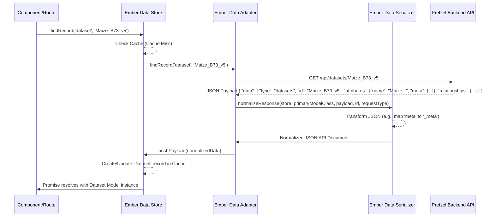

# Chapter 1: Ember Data Models (Dataset, Block, Feature)

Welcome to the Pretzel tutorial! We're diving deep into the architecture of Pretzel, starting with how the frontend application represents the core genomic data it works with.

## Motivation: Structuring Genomic Data in the Frontend

Imagine you're building a complex application like Pretzel, designed to visualize comparative genomics data. You need to fetch data about different datasets (like different genome assemblies or studies), the chromosomes or scaffolds within those datasets (we call these 'Blocks'), and specific points of interest like genes or markers ('Features').

This data often comes from a backend API, usually in JSON format. But how does the frontend application organize, manage, and interact with this data once it arrives? How does it know that a 'Feature' belongs to a specific 'Block', which in turn belongs to a 'Dataset'? How does it handle loading states, track changes, or calculate derived information (like the display color of a feature)?

This is where Ember Data Models come in. Think of them as standardized digital forms within the frontend 'office'. When data arrives from the backend 'warehouse', it's filled into these forms. Each form type (Dataset, Block, Feature) has specific fields (attributes) and connections to other forms (relationships). This structured approach makes it much easier for different parts of the frontend application (like UI components) to understand, access, and manipulate the data consistently.

**Our Central Use Case:** Throughout this chapter, let's consider the goal of loading and displaying a specific chromosome (`Block`) and its associated genetic markers (`Features`) from a chosen genome assembly (`Dataset`) within the Pretzel visualization interface.

## Key Concepts: The Building Blocks of Data Representation

Pretzel uses Ember.js for its frontend, and Ember Data is the standard data management library within the Ember ecosystem. It provides the tools to define models, fetch data, and manage its lifecycle.

The core models in Pretzel mirroring the genomic hierarchy are:

1.  **`Dataset`**: Represents a collection of genomic data, often corresponding to a specific genome assembly, study, or data source. It acts as the top-level container.
2.  **`Block`**: Represents a contiguous segment of a genome, typically a chromosome or scaffold. It belongs to a `Dataset`.
3.  **`Feature`**: Represents a specific genomic element located within a `Block`, such as a gene, marker (SNP), QTL, or annotation.

These are implemented as Ember Data Models. Let's look at their structure.

### The Base: `Record` Model

Many Pretzel models share common properties related to ownership and permissions. These are defined in a base model (`record.js`), which other models like `Dataset`, `Block`, and `Feature` might implicitly inherit or utilize patterns from (though direct inheritance isn't explicitly shown in the provided snippets for `Dataset`, `Block`, `Feature`, the pattern is common).

```javascript
// frontend/app/models/record.js (Simplified)
import Model, { attr } from '@ember-data/model';
import { computed } from '@ember/object';
import { inject as service } from '@ember/service';

export default Model.extend({
  session: service('session'),
  apiServers: service(),

  clientId: attr('string'), // Who owns this record?
  groupId: attr('string'),  // Which group is it shared with?
  public: attr('boolean'),  // Is it publicly visible?
  readOnly: attr('boolean'), // Is it read-only?
  createdAt: attr("date"),
  updatedAt: attr("date"),

  // Computed property to check if the current user owns this record
  owner: computed('clientId', function() {
    // ... logic to compare record's clientId with session's clientId ...
    return /* boolean */ ;
  }),

  // Computed property to check if the record is editable
  editable: computed('owner', 'readOnly', function() {
    return this.get('owner') || !this.get('readOnly');
  }),
});
```

This base model establishes common fields like `clientId` (owner) and `groupId` (sharing) and provides helpful computed properties like `owner` and `editable`.

### `Dataset` Model

This model defines the structure for datasets.

```javascript
// frontend/app/models/dataset.js (Conceptual Structure)
import Model, { attr, hasMany, belongsTo } from '@ember-data/model';
// Base model ('record.js') features like clientId, etc., are typically included
// via backend response and handled by serializers, even if not directly extended.

export default Model.extend({
  // Attributes directly from the data source
  name: attr('string'), // Unique identifier/name
  description: attr('string'),
  _meta: attr(), // Arbitrary metadata (renamed from 'meta')
  tags: attr(), // Tags associated with the dataset

  // Relationships
  blocks: hasMany('block', { async: true, inverse: 'datasetId' }), // Has many Blocks
  parentName: attr('string'), // Name of a potential parent dataset
  // parentId: belongsTo('dataset', { async: true, inverse: 'children' }) // Alternative relationship

  // Inherited/Standard Attributes (like clientId, groupId from record.js pattern)
  clientId: attr('string'),
  groupId: attr('string'),
  public: attr('boolean'),
  // ... other attributes like createdAt, updatedAt
});
```

*   **`attr()`**: Defines simple attributes (like `name`, `description`). Note `_meta` is used instead of `meta` to avoid conflicts with Ember Data's internal `meta` property (this mapping happens in the [Serializers](12_serializers_.md)).
*   **`hasMany('block', ...)`**: Defines a one-to-many relationship. A `Dataset` can have multiple `Block` records associated with it. `async: true` means blocks are loaded on demand, and `inverse: 'datasetId'` tells Ember Data how the relationship is defined on the `Block` model.

### `Block` Model

This model represents chromosomes or scaffolds.

```javascript
// frontend/app/models/block.js (Conceptual Structure)
import Model, { attr, belongsTo, hasMany } from '@ember-data/model';
// Base model features implied

export default Model.extend({
  // Attributes
  name: attr('string'), // e.g., "chr1", "scaffold_123"
  length: attr('number'),
  _meta: attr(), // Metadata for the block (renamed from 'meta')
  tags: attr(),

  // Relationships
  datasetId: belongsTo('dataset', { async: true, inverse: 'blocks' }), // Belongs to one Dataset
  features: hasMany('feature', { async: true, inverse: 'blockId' }), // Has many Features

  // Inherited/Standard Attributes (like clientId, groupId)
  clientId: attr('string'),
  groupId: attr('string'),
  // ... other attributes
});
```

*   **`belongsTo('dataset', ...)`**: Defines a many-to-one relationship. A `Block` belongs to a single `Dataset`. `inverse: 'blocks'` links it back to the `hasMany` relationship defined in the `Dataset` model.
*   **`hasMany('feature', ...)`**: A `Block` contains many `Features`.

### `Feature` Model

This is often the most detailed model, representing specific genomic locations.

```javascript
// frontend/app/models/feature.js (Simplified)
import Model, { attr, belongsTo, hasMany } from '@ember-data/model';
import { computed } from '@ember/object';
import { inject as service } from '@ember/service';

export default Model.extend({
  controls: service(), // Service for UI controls affecting display

  // Relationships
  blockId: belongsTo('block', { async: true, inverse: 'features' }), // Belongs to one Block
  parentId: belongsTo('feature', { async: true, inverse: 'features' }), // Optional parent feature (e.g., gene containing exons)
  features: hasMany('feature', { async: true, inverse: 'parentId' }), // Optional child features

  // Attributes
  _name: attr('string'), // Raw name (renamed from 'name')
  value: attr(), // Position/range, often [start, end]
  values: attr(), // Additional arbitrary data (e.g., { "Trait": "FloweringTime", "Ontology": "GO:12345" })

  // Computed Properties (Derived values)
  name: computed('_name', 'isAnon', function () {
    // Logic to provide a display name, potentially generating one if anonymous
    return this.get('_name') || `Anon:${this.get('value.0')}`;
  }),

  location: computed('value', function() {
    // Convenience getter for the primary location (often start position)
    return this.get('value.0');
  }),

  // Function to get color based on settings
  colour(qtlColourBy) {
    // ... logic using 'values' attribute and controls service ...
    // switch (qtlColourBy) { ... }
    return '#FF0000'; // Example color
  },

  // ... other computed properties like traitColour, ontologyColour, haplotypeColour
});
```

*   **Relationships**: Notice the self-referential `parentId` and `features` allowing for hierarchical features (like exons within a gene).
*   **`_name`**: Similar to `_meta`, the API might provide `name`, but we map it to `_name` via a [Serializer](12_serializers_.md) to allow for a computed `name` property.
*   **`value` vs `values`**: `value` typically holds the core positional data (start, end), while `values` holds other arbitrary key-value pairs associated with the feature.
*   **Computed Properties**: These are powerful. `name` provides a user-friendly name, `location` simplifies accessing the start position, and `colour` dynamically calculates a display color based on application state (e.g., user choices in the UI) and the feature's `values`.

## Solving the Use Case: Fetching and Using Models

Now, let's see how these models help us display a chromosome (`Block`) and its markers (`Features`) from a specific `Dataset`.

1.  **Identify the Target:** The user selects a Dataset (e.g., "Maize_B73_v5") and perhaps a specific Block (e.g., "chr1").
2.  **Fetch the Data:** The application uses the Ember Data `store` service to request the data.

    ```javascript
    // Example: In an Ember Route or Component
    import Route from '@ember/routing/route';
    import { inject as service } from '@ember/service';

    export default class MyRoute extends Route {
      @service store;

      async model(params) {
        // Fetch the specific Dataset record by its ID (which is 'name' here)
        let dataset = await this.store.findRecord('dataset', params.dataset_name);

        // Fetch a specific Block within that dataset (assuming block name is unique within dataset)
        // Note: Often blocks are loaded via the dataset relationship directly
        let targetBlockName = 'chr1';
        let blocks = await dataset.get('blocks'); // Load related blocks
        let block = blocks.find(b => b.name === targetBlockName);

        if (!block) {
          // Handle case where block isn't found
          // Maybe fetch separately if not embedded:
          // block = await this.store.queryRecord('block', { datasetId: dataset.id, name: targetBlockName });
          throw new Error(`Block ${targetBlockName} not found in dataset ${dataset.name}`);
        }

        // Now, load the features associated with that block
        let features = await block.get('features');

        return { dataset, block, features }; // Provide models to the template/component
      }
    }
    ```

    *   `this.store.findRecord('dataset', ...)`: Asks the store for a `Dataset` model with the given ID.
    *   `dataset.get('blocks')`: Accesses the relationship. Because it's `async: true`, if the blocks haven't been loaded yet, Ember Data automatically triggers a request to fetch them based on the relationship definition.
    *   `block.get('features')`: Similarly, fetches the features for the specific block.

3.  **Use the Data:** Components responsible for visualization can now access the loaded data.

    ```hbs
    <!-- Example: In an Ember Template -->
    <h1>Dataset: {{this.model.dataset.name}}</h1>
    <h2>Block: {{this.model.block.name}} (Length: {{this.model.block.length}})</h2>

    <h3>Features:</h3>
    <ul>
      {{#each this.model.features as |feature|}}
        <li style="color: {{feature.colour 'Trait'}}">
          {{feature.name}} @ {{feature.location}}
          <!-- Access other properties like feature.values.Trait -->
        </li>
      {{/each}}
    </ul>
    ```

    *   We directly access model attributes (`dataset.name`, `block.length`).
    *   We access computed properties (`feature.name`, `feature.location`).
    *   We can call model methods (`feature.colour 'Trait'`) to get dynamic values.

## Internal Implementation: Under the Hood

How does `store.findRecord` actually get the data and turn it into these model instances?

**High-Level Flow:**

1.  **Request:** Your component or route calls `store.findRecord('dataset', 'Maize_B73_v5')`.
2.  **Cache Check:** The `store` checks if it already has this specific dataset record loaded in its internal cache. If yes, it returns the cached record (often returning a promise that resolves immediately).
3.  **Adapter:** If not cached, the `store` delegates to the `Adapter` configured for the `dataset` model (usually the application adapter). The adapter's job is to know *how* to fetch data from the backend. It constructs the appropriate API request (e.g., `GET /api/datasets/Maize_B73_v5`).
4.  **API Call:** The adapter sends the request to the [Loopback Application & Server](06_loopback_application___server_.md).
5.  **API Response:** The server processes the request, retrieves data from its database, and sends back a JSON response.
6.  **Serializer:** The adapter receives the JSON payload and passes it to the `Serializer` configured for the `dataset` model.
7.  **Normalization:** The [Serializer](12_serializers_.md) transforms the raw JSON payload into the structure Ember Data expects (the JSON:API format, by default). This is where mappings like `name` to `_name` or `meta` to `_meta` happen, and where relationships are structured correctly.
8.  **Store Update:** The `store` receives the normalized data, creates or updates the corresponding `Dataset` model record in its cache, links any related records (like Blocks, if included/sideloaded), and resolves the original promise returned in step 1 with the model instance.
9.  **Availability:** The model instance is now available to the part of the application that requested it.

**Diagram:**



**Code Snippets Revisited:**

*   **Store:** The store service itself is typically the standard Ember Data store.
    ```javascript
    // frontend/app/services/store.js
    // This just re-exports the standard Ember Data store service
    export { default } from 'ember-data/store';
    ```
*   **Models:** We saw the model definitions (`dataset.js`, `block.js`, `feature.js`) earlier, defining `attr`, `belongsTo`, `hasMany`, and `computed` properties.
*   **Serializers:** These handle the JSON transformation. They are crucial for mapping backend field names or structures to what the Ember models expect.
    ```javascript
    // frontend/app/serializers/dataset.js (Simplified)
    import ApplicationSerializer from './application'; // Often a base serializer
    import { EmbeddedRecordsMixin } from '@ember-data/serializer/rest'; // If embedding records

    export default ApplicationSerializer.extend(EmbeddedRecordsMixin, {
      primaryKey: 'name', // Use 'name' as the ID field instead of 'id'

      attrs: {
        // Map relationship 'blocks' to be embedded directly in the payload
        blocks: { embedded: 'always' },
        // Map API's 'parent' field to model's 'parentName' attribute
        parentName: 'parent',
        // Map API's 'meta' field to model's '_meta' attribute
        _meta: 'meta',
      }
    });
    ```
    ```javascript
    // frontend/app/serializers/feature.js (Simplified)
    import ApplicationSerializer from './application';

    export default ApplicationSerializer.extend({
        attrs: {
        // Map API's 'name' field to model's '_name' attribute
        _name : 'name'
      }
    });
    ```
    These [Serializers](12_serializers_.md) explicitly tell Ember Data how to handle specific attributes (`attrs`), like renaming `meta` to `_meta` or embedding related `blocks` directly within the `Dataset` payload.

## Conclusion

Ember Data Models (`Dataset`, `Block`, `Feature`) provide the essential structure for representing genomic data within the Pretzel frontend. They act as blueprints defining attributes and relationships, allowing Ember Data's `store`, `adapter`, and [Serializers](12_serializers_.md) to manage fetching, caching, and transforming data from the backend API into usable JavaScript objects.

By leveraging these models and their computed properties, the rest of the Pretzel application can interact with complex genomic data in a consistent, predictable, and manageable way, enabling sophisticated visualizations and analyses.

Now that we understand how the data *itself* is represented, the next step is to explore how Pretzel organizes the *visualization* of this data.

**Next:** [Chapter 2: Stacks & Axes (Visualization Layout)](02_stacks___axes__visualization_layout__.md)

---

Generated by [AI Codebase Knowledge Builder](https://github.com/The-Pocket/Tutorial-Codebase-Knowledge)