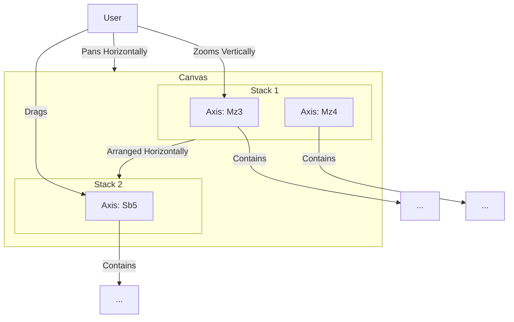
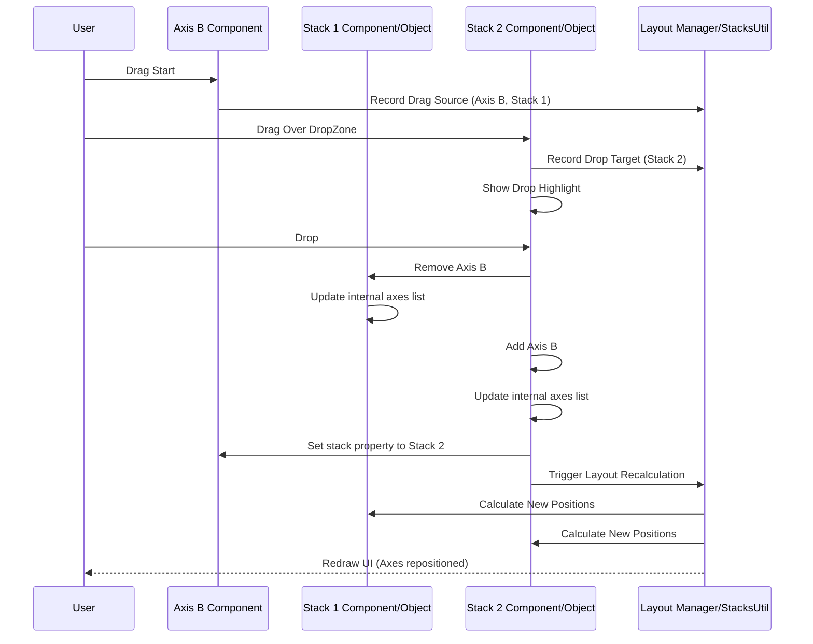

# Chapter 2: Stacks & Axes (Visualization Layout)

In [Chapter 1: Ember Data Models (Dataset, Block, Feature)](01_ember_data_models__dataset__block__feature__.md), we saw how Pretzel represents genomic data like datasets, chromosomes (`Block`), and genes (`Feature`) using Ember Data models. Now, we need a way to visually arrange this data for comparison. How do we place multiple chromosomes side-by-side? How do we handle zooming into a specific region on one chromosome without affecting the vertical scale of another? How do we allow users to dynamically rearrange the layout?

## Motivation: Building the Scaffolding for Comparison

Comparative genomics often involves looking at multiple genomic regions simultaneously. Imagine you want to compare Chromosome 3 of Maize with Chromosome 5 of Sorghum. You need a system to:

1.  **Place them:** Display these two chromosomes as distinct vertical tracks on the screen.
2.  **Group them:** Keep them positioned next to each other horizontally.
3.  **Scale them:** Zoom into a 1 million base pair region on the Maize chromosome while viewing the entire Sorghum chromosome, meaning their vertical scales must be independent.
4.  **Pan them:** Move the view horizontally across the canvas, keeping both chromosomes in view relative to each other.
5.  **Rearrange them:** Allow the user to drag the Sorghum chromosome away from the Maize chromosome and place it next to, say, Maize Chromosome 7, which might be displayed in a different group.

This requires a flexible layout system – a dynamic scaffolding – onto which we can mount our genomic visualizations. In Pretzel, this scaffolding is built using **Stacks** and **Axes**.

**Our Central Use Case:** We want to display Maize Chromosome 3 (`Block` Mz3) and Sorghum Chromosome 5 (`Block` Sb5) side-by-side. We need independent vertical zooming (Y-axis) for each, synchronized horizontal panning (X-axis), and the ability to drag Sb5 to a different horizontal position.

## Key Concepts: The Layout Primitives

Think of the main Pretzel visualization area as a large canvas. Stacks and Axes define how content is arranged on this canvas.

1.  **Axis:**
    *   **What it is:** An `Axis` represents a single, vertically oriented genomic region, typically corresponding to a [Block](01_ember_data_models__dataset__block__feature__.md) model (like a chromosome or scaffold).
    *   **Analogy:** Think of it as a long vertical ruler or track dedicated to one chromosome.
    *   **Function:** It manages its own vertical dimension: its length (based on the `Block`'s length), its vertical zoom level (which part of the chromosome is visible), and its vertical scale (mapping genomic coordinates to screen pixels). Components displaying features ([Paths & Links (Visualization Data)](03_paths___links__visualization_data__.md), markers) are drawn *relative* to this Axis's scale.

2.  **Stack:**
    *   **What it is:** A `Stack` is a container that groups one or more `Axes` horizontally.
    *   **Analogy:** Imagine an adjustable bookshelf column where each shelf holds one `Axis` (though in Pretzel, Axes are side-by-side, not stacked vertically within the 'Stack'). A better analogy might be a horizontal track or lane on the canvas that holds multiple vertical `Axis` strips side-by-side.
    *   **Function:** It manages the horizontal arrangement (`x` position and potentially width allocation) of the `Axes` it contains. A canvas can contain multiple Stacks arranged horizontally.

3.  **Layout Management (Implicit System):**
    *   **What it is:** The overarching system, composed of multiple Stacks and the logic connecting them.
    *   **Function:** It handles the overall horizontal layout of Stacks, global horizontal zoom/pan operations that affect all Stacks, and interactions *between* Stacks, such as dragging an `Axis` from one `Stack` to another.



In this diagram:
*   `Mz3` and `Mz4` are `Axes` grouped horizontally within `Stack 1`.
*   `Sb5` is an `Axis` in `Stack 2`.
*   `Stack 1` and `Stack 2` are arranged horizontally on the `Canvas`.
*   Vertical zoom primarily affects an individual `Axis`.
*   Horizontal pan affects the `Canvas` (moving `Stack 1` and `Stack 2` together).
*   Dragging an `Axis` can move it between `Stacks`.

## Solving the Use Case: Arranging Mz3 and Sb5

Let's apply these concepts to display Maize Chr3 (Mz3) and Sorghum Chr5 (Sb5) side-by-side.

1.  **Create Axes:** Instantiate two `Axis` objects (conceptually), one linked to the `Block` model for Mz3 and one for Sb5. Each `Axis` initializes its own independent vertical scale (Y-axis) based on the length of its corresponding `Block`.
2.  **Create a Stack:** Instantiate a `Stack` object.
3.  **Add Axes to Stack:** Add both the Mz3 `Axis` and the Sb5 `Axis` to this `Stack`. The `Stack` now manages their horizontal positioning, placing them adjacent to each other.
4.  **Display:** The rendering engine uses the `Stack`'s layout information to position the `Axes` horizontally and each `Axis`'s scale information to draw the chromosome tracks and associated features vertically.

**Interactions:**

*   **Vertical Zoom/Pan (Y-axis):** If the user zooms into a region on the Mz3 `Axis`, only the Y-scale of the Mz3 `Axis` is updated. The Sb5 `Axis` remains unaffected vertically. This logic is typically handled within the [Ember Components](04_ember_components__drawing___ui_panels_.md) representing the Axis.
*   **Horizontal Pan (X-axis):** If the user pans horizontally, the layout manager updates the horizontal position of the `Stack` (and any other Stacks) on the canvas. Both Mz3 and Sb5 move together horizontally.
*   **Dragging Sb5:** If the user drags the Sb5 `Axis`, the system detects this interaction. If dropped onto a different `Stack` (or onto a position indicating a new `Stack` should be created), the Sb5 `Axis` is removed from the original `Stack` and added to the target `Stack`. The layout manager then recalculates the horizontal positions for all affected `Stacks` and `Axes`, triggering a redraw.

## Internal Implementation: Under the Hood

How does Pretzel manage this layout dynamically? The implementation involves utility classes, Ember components, and services working together.

**Core Logic:** The primary logic for managing the relationships between Stacks and Axes resides in utility classes and associated Ember objects/components.

*   **`Stack` Class (`frontend/app/utils/stacks.js`):** Defines the fundamental properties and methods for a stack, like adding/removing axes, calculating positions, etc. This is a plain JavaScript class.
*   **`DrawStackObject` Class (`frontend/app/utils/draw/stack.js`):** An EmberObject that often wraps or utilizes the `Stack` logic, potentially adding Ember-specific features like tracked properties. It manages an array of `Axis` objects (often represented by `axis-1d` instances which are conceptually Axes).
*   **`DrawStackViewComponent` (`frontend/app/components/draw/stack-view.js`):** A Glimmer component that renders a `DrawStackObject`. It observes changes in the `DrawStackObject` (like axes being added/removed) and updates the DOM. It also handles UI interactions like drag-and-drop initiation for the stack itself.
*   **Axis Components (e.g., `axis-2d`, `axis-accordion`):** [Ember Components](04_ember_components__drawing___ui_panels_.md) that render individual Axes. They manage the vertical scale (Y-axis) and drawing within their bounds. They contain `in-axis` components (`frontend/app/components/in-axis.js`) for specific content like tracks or charts.
*   **`DropTarget` (`frontend/app/utils/draw/drop-target.js`):** Utility to render and manage the visual drop zones on axes for drag-and-drop interaction.

**Interaction Example: Dragging an Axis**

Let's trace the flow when a user drags `Axis B` from `Stack 1` to `Stack 2`:

1.  **Drag Start:** User clicks and drags the handle of `Axis B` (rendered by its Axis Component). A drag event listener (likely on the Axis Component or its handle) fires.
2.  **Identify Source:** The event handler identifies the dragged `Axis B` and its current `Stack 1` (`axis1d.stack`). Information about the drag operation is stored (e.g., `DrawStackViewComponent.currentDrag`).
3.  **Drag Over:** As the user drags over `Stack 2`, mouseover events on `DropTarget` elements (rendered within `Stack 2`'s axes) trigger.
4.  **Identify Target:** The system identifies `Stack 2` (and potentially a specific position within it) as the current drop target (`DrawStackViewComponent.currentDrop`). Visual feedback is provided (e.g., highlighting the drop zone).
5.  **Drop:** User releases the mouse button over the `Stack 2` drop zone. A drop event listener fires.
6.  **State Update:** The `dropIn` method (e.g., on `Stack 2`'s `DrawStackViewComponent` or `DrawStackObject`) is called.
    *   It removes `Axis B` from `Stack 1`'s internal list of axes (`sourceStack.removeAxis(axisB)`).
    *   It adds `Axis B` to `Stack 2`'s list (`this.insert(insertIndex, axisB)`).
    *   It updates the `stack` property on `Axis B` itself (`axisB.set('stack', this)`).
7.  **Layout Recalculation:** The change in stack composition triggers layout recalculation. This might involve:
    *   `Stack 1` recalculating the positions of its remaining axes.
    *   `Stack 2` recalculating the positions of its axes (including `Axis B`).
    *   The overall layout manager potentially adjusting the horizontal positions of `Stack 1`, `Stack 2`, and any other stacks. (e.g., using `calculatePositions` from `Stack.prototype`).
8.  **Redraw:** The changes in layout data trigger Ember's rendering system. `DrawStackViewComponent`s update the DOM to reflect the new positions and parentage of the Axes. Adjacency information used for drawing links ([Paths & Links (Visualization Data)](03_paths___links__visualization_data__.md)) is also updated (`collateAdjacentAxes` in `stacks-adj.js`).



**Code Snippets:**

*Defining relationship in `DrawStackObject` (Conceptual):*
This EmberObject holds the array of axes belonging to the stack. Changes to this array drive UI updates via the Glimmer component.

```javascript
// Simplified from frontend/app/utils/draw/stack.js
import EmberObject from '@ember/object';
import { tracked } from '@glimmer/tracking';
import { A } from '@ember/array'; // Use Ember Array for observability

export default class DrawStackObject extends EmberObject {
  @tracked axes = A([]); // Tracked Ember array of axis-1d objects
  stackID; // Unique ID for the stack
  stacksView; // Reference to the parent view/manager

  // ... methods like addAxis, removeAxis, findIndex ...

  removeAxis(axis1d) {
    this.axes.removeObject(axis1d);
    this.stacksView?.incrementProperty('axisChanges'); // Signal change
    if (this.axes.length === 0) {
      this.stacksView?.removeStack(this); // Remove empty stack
    }
  }

  insert(insertIndex, axis1d) {
    this.axes.insertAt(insertIndex, axis1d);
    this.stacksView?.incrementProperty('axisChanges'); // Signal change
  }
  // ... other methods like dropIn, dropOut, calculatePositions ...
}
```
*Explanation:* The `@tracked axes = A([]);` line is key. `@tracked` tells Ember to monitor this array for changes (adds/removes). `A()` creates an Ember-aware array. When `removeAxis` or `insert` modifies this array, components observing it will automatically re-render.

*Handling Drop (`dropIn` in `DrawStackObject`):*
This method encapsulates the logic for adding a dragged axis into this stack.

```javascript
  // Simplified from frontend/app/utils/draw/stack.js / components/draw/stack-view.js
  dropIn(event, draggedAxis1d, targetAxis1d, top) {
    console.debug('stack:dropIn', draggedAxis1d, targetAxis1d, top);

    // 1. Determine insertion index based on targetAxis1d and top/bottom drop
    const insertIndex = this.findIndex(targetAxis1d) + (top ? 0 : 1);

    // 2. Get the source stack the axis is coming from
    const sourceStack = draggedAxis1d.stack;

    // 3. Add axis to this stack's internal list
    this.insert(insertIndex, draggedAxis1d);

    // 4. Update the axis's own record of which stack it belongs to
    //    (Using Ember_set for potentially older Ember versions)
    Ember_set(draggedAxis1d, 'stack', this);

    // 5. Remove the axis from its original stack
    if (sourceStack && sourceStack !== this) {
        sourceStack.removeAxis(draggedAxis1d);
    }
    // State change complete, layout recalc & redraw will follow
  }
```
*Explanation:* This function orchestrates the state change: calculating the position (`insertIndex`), adding the axis to the new stack (`this.insert`), updating the axis's `stack` property, and removing it from the old stack (`sourceStack.removeAxis`).

*Calculating Horizontal Positions (`calculatePositions` in `Stack.prototype`):*
This utility function determines the relative X coordinates for axes within a stack based on their assigned portions (widths).

```javascript
// Simplified from frontend/app/utils/stacks.js (Stack.prototype)
  calculatePositions() {
    const portions = this.portions; // Get portion array [0.5, 0.5] for 2 equal axes
    let positions = [], pos = 0;
    if (!portions) return positions; // Handle case where portions aren't ready

    for (let i=0; i < portions.length; i++) {
        positions[i] = pos;
        pos += portions[i]; // Accumulate position for the next axis
    }
    // Result: e.g., [0, 0.5] for two equal portions
    // This relative position is then scaled by the stack's total width
    return positions;
  }
```
*Explanation:* The `portions` (e.g., `[0.5, 0.5]` if two axes share the stack equally) determine the relative starting `x` coordinate for each axis within the stack. The actual screen position also depends on the stack's own position and width on the canvas.

*Updating Y-Axis Domain/Range (`updateDomain`, `updateRange` in `stacksLayout.js`):*
These functions ensure an Axis's vertical scale correctly reflects the genomic coordinates it's displaying and its allocated screen space.

```javascript
// Simplified from frontend/app/utils/stacksLayout.js
/** Updates the vertical domain (genomic coordinates) */
function updateDomain(yScale, ysScale, axis, domain) {
  if (domain === undefined) {
    domain = axis.getDomain(); // Get [start, end] from the Block(s)
    // domain = maybeFlip(domain, axis.flipped); // Apply inversion if needed
  }
  yScale.domain(domain); // Update the D3 scale's input domain
  ysScale.domain(domain);
}

/** Updates the vertical range (pixels) */
function updateRange(yScale, ysScale, viewConstants, axis) {
  if (ysScale) { // Check if scale exists
    let yRangePixels = viewConstants.yRange - axisGap; // Total vertical pixels available
    // yScale maps domain to the full available height (for the axis line itself)
    yScale.range([0, yRangePixels]);

    // ysScale maps domain to the height allocated *within* the stack (for features)
    let portionedHeight = axis.yRange(); // Calculates height based on portion
    ysScale.range([0, portionedHeight]);

    // Update associated D3 brush extent if applicable
    // yScale.brush.extent(...);
  }
}
```
*Explanation:* `updateDomain` sets the *input* for the vertical D3 scale (the genomic coordinates), while `updateRange` sets the *output* (the pixel range on the screen). This separation allows independent vertical zooming/panning for each axis.

## Conclusion

Stacks and Axes form the foundational layout system in Pretzel, providing the flexible scaffolding needed for comparative genomics visualization. `Axes` manage the vertical representation and scaling of individual genomic regions ([Blocks](01_ember_data_models__dataset__block__feature__.md)), while `Stacks` group these `Axes` horizontally. This system handles positioning, scaling, zooming, panning, and dynamic rearrangement through user interactions like drag-and-drop.

Understanding this layout system is crucial for comprehending how different genomic datasets are brought together visually for comparison. It allows independent control over vertical scales while maintaining horizontal relationships between compared regions.

With the data models defined and the layout scaffolding in place, we can now explore how the actual comparative data – the links and relationships *between* features on different axes – is represented and drawn.

**Next:** [Chapter 3: Paths & Links (Visualization Data)](03_paths___links__visualization_data__.md)

---

Generated by [AI Codebase Knowledge Builder](https://github.com/The-Pocket/Tutorial-Codebase-Knowledge)