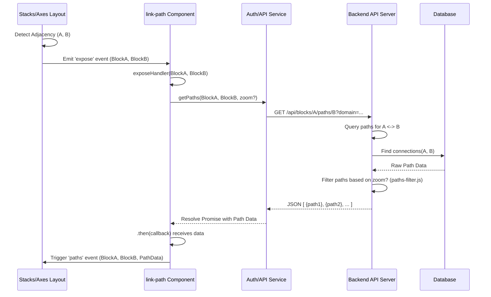

# Chapter 3: Paths & Links (Visualization Data)

In [Chapter 2: Stacks & Axes (Visualization Layout)](02_stacks___axes__visualization_layout__.md), we established the layout system that arranges genomic regions (Axes) side-by-side in containers (Stacks). This provides the visual scaffolding. But the core purpose of Pretzel is *comparison* – seeing how these different regions relate to each other. How do we represent and fetch the data that defines these relationships, like homology or synteny?

## Motivation: Connecting the Dots Between Genomes

Imagine you have Maize Chromosome 3 (Mz3) displayed on one Axis and Sorghum Chromosome 5 (Sb5) on an adjacent Axis. You know there are regions of conserved gene order (synteny) between them. How does Pretzel know which gene on Mz3 corresponds to which gene on Sb5? And how does it get the specific coordinate information needed to draw a line or ribbon connecting them visually?

We need an abstraction that:

1.  **Detects Adjacency:** Knows when two Axes (like Mz3 and Sb5) are placed next to each other in the layout.
2.  **Fetches Relationship Data:** Requests the relevant homology/synteny data from the backend specifically for these adjacent blocks.
3.  **Processes Data:** Transforms the raw backend data into a format suitable for visualization components.

This abstraction deals with **Paths** (the underlying connection data) and **Links** (the conceptual representation and fetching mechanism in the frontend). Think of it like having two related documents side-by-side; this system finds the corresponding paragraphs or sentences and gathers the information needed to draw connecting lines between them.

**Our Central Use Case:** We want to fetch and prepare the data needed to draw lines connecting syntenic genes between Maize Chromosome 3 (Mz3) and Sorghum Chromosome 5 (Sb5), displayed on adjacent Axes in the Pretzel visualization.

## Key Concepts: Representing Genomic Relationships

1.  **Path Data:** This is the raw information describing a relationship between two points or regions across different [Blocks](01_ember_data_models__dataset__block__feature__.md). It typically includes:
    *   Identifiers for the two connected [Features](01_ember_data_models__dataset__block__feature__.md) (e.g., gene IDs).
    *   Coordinates (start/end positions) of these features on their respective Blocks.
    *   Identifiers for the Blocks involved.
    *   Potentially, metadata about the relationship (e.g., alignment score, type of homology).
    *   This data originates from the backend database, often pre-computed by bioinformatics pipelines.

2.  **Link Fetching Logic (`link-path` Component):** In Pretzel, components like `link-path` often encapsulate the logic for fetching this Path data. Key responsibilities include:
    *   **Listening for Adjacency:** Reacting to events indicating which Axes are currently adjacent (information derived from the [Stacks & Axes](02_stacks___axes__visualization_layout__.md) layout).
    *   **Formulating API Requests:** Constructing requests to the [Loopback Application & Server](06_loopback_application___server_.md) to get paths for specific Block pairs.
    *   **Handling Responses:** Receiving the Path data (usually JSON) from the backend.
    *   **Triggering Data Availability:** Making the fetched data available to other parts of the application (e.g., by triggering events like `paths` or `pathsByReference`).

3.  **Types of Paths:**
    *   **Direct Links:** Connections where features on adjacent blocks share a common identifier or a direct mapping (e.g., orthologous genes with related IDs). The backend might provide a list of paired feature coordinates.
    *   **Indirect/Reference-Based Links (Synteny Blocks):** Connections established via a common reference genome or representing larger conserved blocks (synteny). The backend might provide data defining the start/end regions of the syntenic block on each chromosome, sometimes involving multiple features. `getPathsByReference` is an example API endpoint for this.
    *   **Data Filtering:** Path data can be extensive. The backend (e.g., using `paths-filter.js`) might filter paths based on the current zoom level (domain) of the Axes to avoid overwhelming the frontend with too much data.

4.  **Path Data Model (`path-data`):** While not a full Ember Data model in the traditional sense (it's often created on-the-fly), there's a conceptual or utility model (`frontend/app/models/draw/path-data.js`) that holds the processed data for a single link. It typically references the two connected `Feature` objects (or their data) and provides computed properties or methods useful for drawing, like calculating the SVG path string.

## Solving the Use Case: Fetching Synteny Data for Mz3 and Sb5

Let's trace how we get the data to draw links between the adjacent Mz3 and Sb5 Axes:

1.  **Layout Detection:** The [Stacks & Axes](02_stacks___axes__visualization_layout__.md) system updates, placing the Mz3 Axis and Sb5 Axis next to each other. Logic (e.g., in `stacks-adj.js`) detects this adjacency.
2.  **Adjacency Signal:** An event (e.g., `expose`) is triggered, carrying the `Block` IDs (or objects) for Mz3 and Sb5.
3.  **Request Trigger:** The `link-path` component, listening for the `expose` event, receives the Mz3 and Sb5 block information via its `exposeHandler`.
4.  **API Call:** Inside `exposeHandler`, the component checks if the blocks are on compatible servers (`blockService.blocksSameServer`). If so, it calls methods like `request(mz3Block, sb5Block)` and potentially `requestByReference(mz3Block, sb5Block)`.
5.  **Fetch Data:** The `request` method uses an [Ember Service](07_ember_services__api___state__.md) (like `auth` which wraps API calls) to send requests to the backend:
    *   `auth.getPaths(mz3Block, sb5Block, ...)` for direct links.
    *   `auth.getPathsByReference(mz3Block, sb5Block, referenceGenome, ...)` for synteny blocks.
6.  **Backend Processing:** The [Loopback Application & Server](06_loopback_application___server_.md) queries its database for connections between Mz3 and Sb5. If zoom information was passed, it might use `paths-filter.js` to return only paths relevant to the visible regions.
7.  **Receive Data:** The `link-path` component receives the JSON response(s) containing arrays of path data objects.
8.  **Data Propagation:** The component triggers events like `'paths'` or `'pathsByReference'`, passing the received data along.
    ```javascript
    // Simplified conceptual flow within link-path.js
    // ... after receiving API response 'res' for paths between blockA and blockB ...
    if (res && res.length > 0) {
      // 'pathReceiver' is typically the main drawing component (e.g., draw-map)
      this.get('pathReceiver').trigger('paths', blockA, blockB, res);
    }
    // Similar trigger for 'pathsByReference'
    ```
    *Explanation:* Once path data `res` arrives from the backend, the `link-path` component uses `trigger` to notify the designated `pathReceiver` component, passing the blocks involved and the actual path data.

9.  **Data Consumption:** The `pathReceiver` component (often the main `draw-map` component) listens for these events. It takes the raw path data, potentially processes it further (e.g., creating `path-data` instances), and stores it ready for rendering by dedicated [Ember Components (Drawing & UI Panels)](04_ember_components__drawing___ui_panels__.md).

Now, the application has the necessary information (pairs of features/coordinates) to draw the connecting lines or ribbons between Mz3 and Sb5.

## Internal Implementation: Under the Hood

Let's visualize the typical flow for fetching path data when two axes become adjacent.

**Step-by-Step Flow:**

1.  **Layout Change:** User action (e.g., drag-and-drop) makes Axis A (Block A) and Axis B (Block B) adjacent. The [Stacks & Axes](02_stacks___axes__visualization_layout__.md) system updates its state.
2.  **Adjacency Calculation:** Utility code (`stacks-adj.js`) recalculates which axes are neighbors.
3.  **Event Emission:** The layout system emits an `expose` event, indicating `Block A` and `Block B` are now adjacent.
4.  **Event Listener:** The `link-path` component's `exposeHandler` catches this event.
5.  **API Request:** The handler calls its internal `request` method, which uses the `auth` service's `getPaths(blockA, blockB)` method.
6.  **Service Call:** The `auth` service constructs the appropriate HTTP request (e.g., `GET /api/blocks/{blockA_id}/paths/{blockB_id}`) and sends it to the [Loopback Application & Server](06_loopback_application___server_.md). Optionally includes zoom/domain info as query parameters.
7.  **Backend Query:** The Loopback server receives the request. It queries its database for path data connecting Block A and Block B.
8.  **Backend Filtering (Optional):** If zoom/domain parameters are present, the server uses logic like in `paths-filter.js` to filter the results, returning only paths relevant to the visible regions.
9.  **Backend Response:** The server sends back a JSON response containing an array of path objects.
10. **Service Response:** The `auth` service receives the response and resolves the promise returned to `link-path`.
11. **Data Propagation:** The `link-path` component receives the data in its `.then()` callback and triggers a `paths` event on its `pathReceiver` attribute, passing the fetched data.
12. **Data Storage/Processing:** The `pathReceiver` component (e.g., `draw-map`) receives the data and stores it, making it ready for rendering components.

**Sequence Diagram:**



**Code Snippets:**

*   **`link-path.js` - Listening for Adjacency and Requesting Paths:**
    ```javascript
    // frontend/app/components/draw/link-path.js (Simplified)
    import Component from '@ember/component';
    import { inject as service } from '@ember/service';

    export default Component.extend({
      auth: service('auth'),
      blockService: service('data/block'),
      stackEvents: null, // Injected service or object for layout events
      pathReceiver: null, // Target component to send data to

      didInsertElement() {
        this._super(...arguments);
        // Listen for the 'expose' event from the layout system
        this.get('stackEvents').on('expose', this, this.exposeHandler);
      },

      willDestroyElement() {
        this.get('stackEvents').off('expose', this, this.exposeHandler);
        this._super(...arguments);
      },

      exposeHandler(blockA, blockB) {
        // Check if blocks are on compatible servers (simplified)
        if (!this.get('blockService').blocksSameServer(blockA, blockB)) {
          return;
        }
        // Request direct paths
        this.request(blockA, blockB);
        // Optionally request reference-based paths
        // this.requestByReference(blockA, blockB);
      },

      request(blockA, blockB) {
        let me = this;
        // Use the auth service to fetch paths
        this.get('auth').getPaths(blockA, blockB, true, /*options*/)
          .then(res => {
            // On success, trigger 'paths' event on the receiver
            me.get('pathReceiver').trigger('paths', blockA, blockB, res);
          })
          .catch(err => {
            console.error('Path request failed:', err);
          });
      },
      // requestByReference would be similar but call auth.getPathsByReference
    });
    ```
    *Explanation:* This component listens for the `expose` event. When triggered, the `exposeHandler` calls the `request` function, which in turn uses the `auth` service to make the API call. The response data is then sent to the `pathReceiver` via another event trigger.

*   **`path-data.js` - Calculating SVG Path Coordinates:**
    The actual `path-data.js` file defines an Ember Data model structure, but the core calculation logic for drawing often happens where the data is consumed, using utility functions. Conceptually, for each path data object received, you need to calculate the SVG `d` attribute:

    ```javascript
    // frontend/app/utils/draw/path-data.js (Conceptual Utility Usage)
    import { PathDataUtils } from './path-data'; // The utility class/functions
    import { stacks } from '../stacks'; // Access to layout info

    // Assume 'path' is an object from the backend response,
    // containing feature info for block0 and block1.
    // Assume 'stacks.oa' provides access to axis layout/scales.
    function calculateSvgPath(path) {
      const pathDataUtils = PathDataUtils(stacks.oa); // Initialize utils with layout context

      // Get block IDs and feature names/coords from the path object
      let blockId0 = path.blockId0; // e.g., from path.feature0.blockId
      let blockId1 = path.blockId1; // e.g., from path.feature1.blockId
      let featureName0 = path.feature0.name;
      let featureName1 = path.feature1.name;

      // Use the utility to calculate the SVG 'd' attribute string
      // pathDataUtils.patham maps feature coords to screen coords based on axis scales
      let svg_d_attribute = pathDataUtils.patham(blockId0, blockId1, featureName0, featureName1);

      return svg_d_attribute; // e.g., "M100,50 C150,100 250,100 300,150"
    }
    ```
    *Explanation:* This function uses `PathDataUtils`, initialized with the current layout context (`stacks.oa`), to translate the genomic coordinates of the linked features (`featureName0`, `featureName1` on `blockId0`, `blockId1`) into screen coordinates and generate the SVG path string (`d` attribute) needed for drawing the connection.

*   **`synteny-blocks-draw.js` - Drawing Synteny Blocks:**
    Synteny blocks are a specific type of path data. This utility focuses on drawing them.

    ```javascript
    // frontend/app/utils/draw/synteny-blocks-draw.js (Simplified)
    import { isAdjacent } from '../stacks-adj';
    import { PathDataUtils } from './path-data';

    // Assume 'syntenyBlocks' is an array of synteny block data from backend
    // Assume 'oa' is the drawing context object containing svgContainer, scales etc.
    function showSynteny(syntenyBlocks, oa) {
      const pathDataUtils = PathDataUtils(oa); // Get utils

      // Filter for blocks that are actually adjacent in the current view
      let adjacentSynteny = syntenyBlocks.filter(sb => isAdjacent(sb[0], sb[1]));
      // Further filtering (size, zoom level) might occur here...

      // Use D3.js to bind data and draw paths
      let paths = oa.svgContainer.select("g.synteny") // Select the container <g>
        .selectAll("path.syntenyEdge")
        .data(adjacentSynteny, sb => sb[6]); // Bind data using unique ID (index 6)

      paths.enter() // Create new paths for new data
        .append("path")
        .attr("class", "syntenyEdge")
        .merge(paths) // Merge new and existing paths
        .attr("d", s => pathDataUtils.patham2(s[0], s[1], s.slice(2))); // Calculate 'd' attr

      paths.exit().remove(); // Remove paths for data that's gone
    }
    ```
    *Explanation:* This function takes an array of `syntenyBlocks` data, filters them based on adjacency (`isAdjacent`) and potentially other criteria. It then uses D3's data binding pattern (`.data()`, `.enter()`, `.merge()`, `.exit()`) to efficiently draw/update SVG `<path>` elements. The `d` attribute for each path is calculated using `pathDataUtils.patham2`, which is specialized for synteny block data (often involving 4 points for a ribbon).

*   **Backend Filtering (`paths-filter.js`):**
    On the server side, if the request includes zoom information (the `domain` for each axis), this utility helps filter the paths before sending them to the client.

    ```javascript
    // lb4app/lb3app/common/utilities/paths-filter.js (Conceptual)
    function filterPaths(allPathsForBlocks, intervals) {
      let filteredPaths = allPathsForBlocks;

      // Check if domain filtering is needed based on 'intervals' (zoom info)
      if (intervals.axes[0].zoomed || intervals.axes[1].zoomed) {
        filteredPaths = domainFilter(allPathsForBlocks, intervals);
      }

      // Apply density filtering if needed (e.g., sampling)
      // filteredPaths = densityFilter(filteredPaths, intervals);

      // Limit total number of paths returned
      if (filteredPaths.length > intervals.nFeatures) {
        filteredPaths = filteredPaths.slice(0, intervals.nFeatures);
      }
      return filteredPaths;
    }

    function domainFilter(paths, intervals) {
      // ... logic to check if features within each path fall
      // within the domains specified in intervals.axes[0].domain
      // and intervals.axes[1].domain ...
      // Returns only paths where BOTH endpoints are within the domains
      // (or one endpoint if allowPathsOutsideZoom is true)
      return paths.filter(/* filter logic based on intervals */);
    }
    ```
    *Explanation:* The backend uses functions like `filterPaths` and `domainFilter` to reduce the amount of path data sent to the frontend, especially when the user is zoomed in. This prevents sending potentially thousands of paths when only a few are visible, improving performance.

## Conclusion

Paths & Links are the crucial abstraction in Pretzel for representing and fetching the comparative genomics data – the connections between features on different Blocks/Axes. By listening to layout changes, components like `link-path` dynamically request the relevant path data (direct links or synteny blocks) from the backend. Utilities like `PathDataUtils` then help transform this data into a format ready for visualization. This mechanism allows Pretzel to efficiently display complex relationships between multiple genomic regions.

Now that we understand how the data is modelled ([Chapter 1](01_ember_data_models__dataset__block__feature__.md)), how the layout is structured ([Chapter 2](02_stacks___axes__visualization_layout__.md)), and how the connection data is fetched ([Chapter 3](03_paths___links__visualization_data__.md)), we are ready to see how all of this is actually drawn on the screen and interacted with by the user.

**Next:** [Chapter 4: Ember Components (Drawing & UI Panels)](04_ember_components__drawing___ui_panels__.md)

---

Generated by [AI Codebase Knowledge Builder](https://github.com/The-Pocket/Tutorial-Codebase-Knowledge)