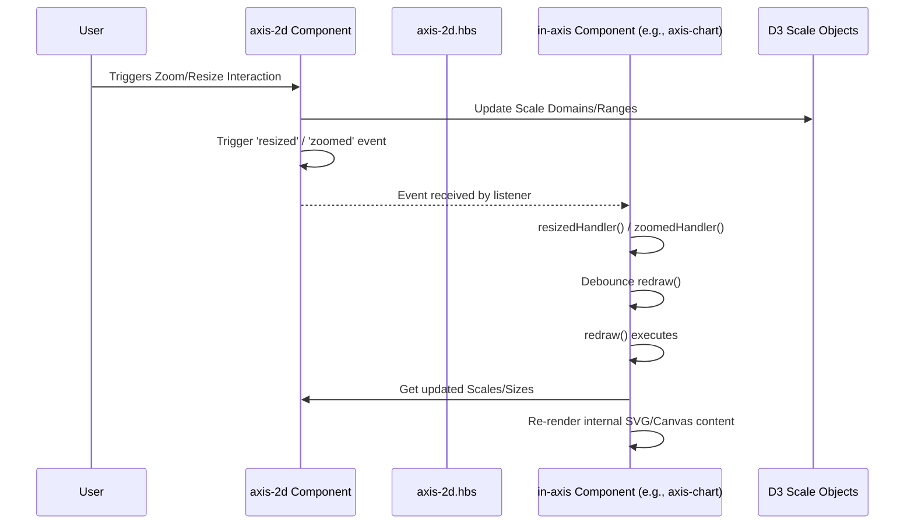

# Chapter 4: Ember Components (Drawing & UI Panels)

In the previous chapter, [Paths & Links (Visualization Data)](03_paths___links__visualization_data__.md), we saw how Pretzel fetches the data connecting different genomic regions displayed on adjacent axes. We have the data models ([Chapter 1](01_ember_data_models__dataset__block__feature__.md)), the layout system ([Chapter 2](02_stacks___axes__visualization_layout__.md)), and the connection data ([Chapter 3](03_paths___links__visualization_data__.md)). Now, how do we actually build the user interface elements that display all this information and allow users to interact with it?

## Motivation: Building a Modular and Reusable Interface

Imagine constructing a complex building like the Pretzel application interface. You wouldn't build every wall, window, and control panel from scratch on-site. Instead, you'd use prefabricated sections: standardized wall panels, window units, pre-wired control boards. This makes construction faster, more consistent, and easier to manage.

Similarly, building a complex web application front-end requires breaking down the UI into manageable, reusable pieces. We need components for:

*   The main visualization canvas where genomes are drawn.
*   Each individual chromosome track (Axis).
*   The specific data tracks *within* an axis (genes, markers, charts).
*   Side panels containing controls, forms, and data listings.
*   Smaller, reusable elements like buttons, headings, or container boxes.

Without a component system, the codebase would become a monolithic tangle, making it difficult to update, test, or reuse parts of the UI. Ember Components provide this modularity. They are the prefabricated walls, windows, and control panels of the Pretzel frontend.

**Our Central Use Case:** We want to understand how Pretzel uses components to construct its main interface, specifically focusing on how the central drawing area (`draw-map`), the individual chromosome tracks (`axis-2d`), and the side panels (`panel/left-panel`) are implemented and interact.

## Key Concepts: The Building Blocks of the UI

Ember Components are the core building block for UIs in Ember.js. Each component encapsulates a piece of the user interface and its associated behavior.

1.  **Structure:** An Ember component typically consists of:
    *   **Template (`.hbs` file):** Defines the HTML structure (what gets rendered). Uses Handlebars syntax for dynamic content and logic.
    *   **JavaScript Class (`.js` file):** Defines the component's behavior, state (data), and lifecycle hooks. Modern Ember uses Glimmer components (class-based).

2.  **Data Flow:**
    *   **Arguments (`@argName`):** Data is passed *into* a component from its parent using named arguments (e.g., `<MyComponent @data={{this.someData}} />`).
    *   **State (`@tracked`):** Internal state within a component is managed using `@tracked` properties. Changes to tracked properties automatically trigger UI updates.
    *   **Computed Properties (`@computed`):** Derived values based on arguments or tracked state. They also update automatically.

3.  **Lifecycle Hooks:** Components have lifecycle hooks – methods that Ember calls at specific points (e.g., when the component is added to the DOM (`didInsertElement` in classic components, or using modifiers like `{{did-insert}}` in Glimmer), or when it's about to be removed (`willDestroyElement`/`{{will-destroy}}`)). These are used for setup (like adding event listeners) and teardown.

4.  **Actions:** Components handle user interactions (like button clicks) using actions, which are typically functions defined in the component's JavaScript class.

## Key Component Categories in Pretzel

Pretzel organizes its components based on their function:

1.  **Drawing Components (`frontend/app/components/draw/*`)**: Responsible for rendering the main visualization elements.
    *   **`draw-map`**: The top-level component for the entire visualization area. It orchestrates the drawing of stacks, axes, and links. It often holds the main drawing context (`oa`).
    *   **`draw/stack-view`**: Renders a single [Stack](02_stacks___axes__visualization_layout__.md), containing one or more `Axis` components side-by-side. Manages horizontal layout within the stack and drag/drop interactions *between* stacks.
    *   **`axis-2d` / `axis-accordion`**: Renders a single vertical [Axis](02_stacks___axes__visualization_layout__.md), usually representing a [Block](01_ember_data_models__dataset__block__feature__.md). Manages its vertical scale (y-axis), zoom/pan, and contains `in-axis` components for the actual data display.
    *   **`in-axis` (`frontend/app/components/in-axis.js`)**: A base component (often mixed into others like `axis-chart`, `axis-track`) for elements rendered *inside* an axis. It standardizes handling of zoom/resize events delegated from the parent `axis-2d` or `axis-accordion`.
    *   **`draw/graph-annotations`**: Draws visual lines connecting axis positions to related information in UI panels (like genotype tables).
    *   **`draw/axis-blocks`**: Manages the allocation of horizontal space within an axis when multiple blocks/tracks are displayed side-by-side *within* that single axis (e.g., multiple tracks for the same chromosome).

2.  **UI Panel Components (`frontend/app/components/panel/*`)**: Build the collapsible side panels and their contents.
    *   **`panel/left-panel` / `panel/right-panel`**: Define the structure and tabs for the main left and right sidebars.
    *   **`panel/manage-*` (e.g., `manage-view`, `manage-explorer`, `manage-dataset`)**: Components dedicated to specific tasks within the panels, like managing viewed datasets, exploring available data, or uploading new data. These often inherit from `panel/manage-base`.
    *   **`panel/manage-base`**: A base component providing common structure or behavior for `manage-*` components.

3.  **Form Components (`frontend/app/components/form/*`)**: Reusable components for building forms (e.g., input fields, dropdowns, buttons with specific validation or behavior).

4.  **Element Components (`frontend/app/components/elem/*`)**: Small, highly reusable UI primitives.
    *   **`elem/panel-container`**: A simple wrapper component to create a standard bordered panel with a heading and collapsible content, often used within the main side panels.

## Solving the Use Case: Assembling the Main Interface

Let's see how these components are used to build the main Pretzel view (map, axes, side panels). The primary layout is often defined in the main application template (`frontend/app/templates/application.hbs`) or a specific route's template (like `mapview`).

```hbs
<!-- Conceptual structure (Simplified application.hbs or route template) -->
<div class="pretzel-container">

  <!-- Left Sidebar Panel -->
  <Panel::LeftPanel @model={{this.model}} @displayData={{this.displayData}} />

  <!-- Main Visualization Area -->
  <div class="main-content">
    {{!-- Other elements like menus might go here --}}

    {{!-- The core drawing component --}}
    <DrawMap @model={{this.model}} @displayData={{this.displayData}} />
  </div>

  <!-- Right Sidebar Panel (Conditional) -->
  {{#if this.showRightPanel}}
    <Panel::RightPanel @model={{this.model}} />
  {{/if}}

</div>
```

*Explanation:* This template uses component invocation syntax (e.g., `<Panel::LeftPanel ... />` or `{{draw-map ...}}` for older syntax).
*   It includes the `<Panel::LeftPanel>` component, passing in the main data model (`@model`) and potentially information about displayed blocks (`@displayData`).
*   It includes the `<DrawMap>` component, which is the heart of the visualization, also receiving necessary data.
*   It conditionally includes `<Panel::RightPanel>`.
*   Each of these top-level components (`Panel::LeftPanel`, `DrawMap`, `Panel::RightPanel`) will, in turn, render *other* components in their own templates. For instance, `DrawMap`'s template will likely render `Draw::StackView` components, which render `Axis2d` components, and so on.

**Data Flow Example:**
The `@model` passed down might contain references to the [Datasets](01_ember_data_models__dataset__block__feature__.md), [Blocks](01_ember_data_models__dataset__block__feature__.md), user settings, etc., loaded by the route. Components access this data (`this.args.model`) and pass relevant parts further down to their children or use it to configure their own behavior.

## Internal Implementation: How Components Work

Let's look under the hood at how components render and interact, focusing on how an axis component might handle a resize event.

**Rendering Flow:**

1.  **Invocation:** Ember's rendering engine encounters a component tag in a template (e.g., `<Axis2d @axis1d={{axisData}} />` inside `draw/stack-view.hbs`).
2.  **Instantiation:** Ember creates an instance of the corresponding component class (`axis-2d.js`). It passes the arguments (`@axis1d`) to the instance.
3.  **Template Rendering:** Ember renders the component's template (`axis-2d.hbs`), providing the component instance as the context (`this`). The template can access arguments (`this.args.axis1d`) and internal state/computed properties.
4.  **Lifecycle Hooks:** As the component's element is created and inserted into the DOM, lifecycle hooks fire. For example, a classic component's `didInsertElement` hook might be used to set up D3 scales or add event listeners not easily handled by templates.
5.  **DOM Insertion:** The rendered HTML is placed into the main document's DOM.

**Interaction Example: Resizing/Zooming an Axis**

Consider the `in-axis` component, which is often the base for drawing content *within* an axis (`axis-2d` or `axis-accordion`). It needs to react when the parent axis is resized or zoomed.

1.  **Parent Setup (`axis-2d.js`):** The parent `axis-2d` component likely sets up D3 scales and handles the primary zoom/resize logic. When a zoom/resize occurs, it needs to notify its children.
2.  **Event Emission (`axis-2d.js`):** After updating its scales or size, the `axis-2d` component triggers custom events like `resized` or `zoomed`. Ember components have a simple event emitter capability (`this.trigger('eventName', ...args)` in classic components, or passing functions down as arguments `@onZoomed={{this.handleZoom}}` in Glimmer).
3.  **Child Listener (`in-axis.js`):** The `in-axis` component (or components inheriting from it like `axis-chart`) registers listeners for these events in its `didInsertElement` hook (or equivalent setup phase).
    ```javascript
    // frontend/app/components/in-axis.js (Simplified didInsertElement)
    import Component from '@ember/component';
    import { debounce } from '@ember/runloop';

    export default Component.extend({
      axis: null, // Passed in argument: the parent axis-2d component instance

      didInsertElement() {
        this._super(...arguments);
        let axisComponent = this.get("axis");
        if (axisComponent) {
          // Listen for 'resized' event from the parent axis component
          axisComponent.on('resized', this, this.resizedHandler);
          // Listen for 'zoomed' event from the parent axis component
          axisComponent.on('zoomed', this, this.zoomedHandler);
        }
      },

      willDestroyElement() {
        let axisComponent = this.get("axis");
        if (axisComponent) {
          // Clean up listeners
          axisComponent.off('resized', this, this.resizedHandler);
          axisComponent.off('zoomed', this, this.zoomedHandler);
        }
        this._super(...arguments);
      },

      resizedHandler(prevSize, currentSize) {
        console.log("Child component received resize:", currentSize);
        // Debounce the redraw logic to avoid excessive updates
        debounce(this, this.redraw, 100);
      },

      zoomedHandler(axisID_t) {
        console.log("Child component received zoom:", axisID_t);
        // Debounce the redraw logic
        debounce(this, this.redraw, axisID_t, 100);
      },

      redraw(/* optional args */) {
        if (!this.isDestroying) {
          console.log("Child component redrawing content...");
          // Actual drawing logic using D3 or other methods based on
          // updated scales/sizes obtained from the parent `axis` component
          // or its associated axis1d object.
        }
      }
    });
    ```
    *Explanation:* The `in-axis` component, when inserted, gets a reference to its parent `axis` component and uses `.on()` to subscribe to `resized` and `zoomed` events. When these events are triggered by the parent, the `resizedHandler` or `zoomedHandler` methods are called. These typically debounce a `redraw` method to efficiently update the component's visualization based on the new dimensions or scale. `.off()` is used in `willDestroyElement` to prevent memory leaks.

4.  **Redrawing:** The `redraw` method within `in-axis` (or its child like `axis-chart`) accesses the updated scales or dimensions from the parent `axis` component (e.g., `this.get('axis.yScale')`) and re-renders its specific content (like chart bars or feature tracks).

**Simplified Interaction Diagram:**



**Example: `elem/panel-container`**

This component shows simple encapsulation for UI structure.

```javascript
// frontend/app/components/elem/panel-container.js (Simplified)
import Component from '@ember/component';
import { computed } from '@ember/object';

export default Component.extend({
  // Attributes passed in: title, state ('default', 'primary' etc for styling)
  // Internal state:
  showComponent: true, // Default to showing content

  classNameBindings: ['panelClass'],
  panelClass: computed('state', function() {
    // Calculates CSS class based on the 'state' argument
    return 'panel panel-' + (this.get('state') || 'default');
  }),

  actions: {
    toggleShow() {
      // Action typically triggered by a child (e.g., panel-heading) button
      this.toggleProperty('showComponent');
    }
  }
});
```

```hbs
<!-- frontend/app/templates/components/elem/panel-container.hbs (Simplified) -->
<div class={{this.panelClass}}>
  {{!-- Yield content blocks for heading and body --}}
  {{yield (hash
      showComponent=this.showComponent
      toggleShow=(action "toggleShow")
    )
    to="heading"
  }}

  {{#if this.showComponent}}
    <div class="panel-body">
      {{yield to="body"}}
    </div>
  {{/if}}
</div>

{{!-- Usage example within another template: --}}
<Elem::PanelContainer @state="primary" as |Panel|>
  <:heading>
    {{!-- panel-heading component would likely go here --}}
    <h4>My Panel Title</h4>
    <button {{on "click" Panel.toggleShow}}>
      {{if Panel.showComponent "Hide" "Show"}}
    </button>
  </:heading>
  <:body>
    <p>This is the collapsible content.</p>
    {{!-- Other components or content --}}
  </:body>
</Elem::PanelContainer>
```

*Explanation:* The `panel-container` component manages its own `showComponent` state. It yields out this state and its `toggleShow` action using the `as |Panel|` block syntax. This allows components placed inside its named blocks (`<:heading>`, `<:body>`) to access the state (`Panel.showComponent`) and trigger the action (`Panel.toggleShow`), enabling the collapsible behavior while keeping the logic encapsulated within `panel-container`.

## Conclusion

Ember Components are fundamental to Pretzel's frontend architecture. They break the complex UI into manageable, reusable, and testable pieces, analogous to using prefabricated parts in construction. Components like `draw-map`, `axis-2d`, `in-axis`, `panel/left-panel`, and `elem/panel-container` encapsulate specific UI structures and behaviors, from rendering complex visualizations to managing simple panel visibility. They communicate through arguments (`@arg`), internal state (`@tracked`), and actions.

Understanding how these components are structured, how they interact (especially via events or passed actions), and how data flows through them is key to understanding the Pretzel frontend.

With data models, layout, link fetching, and component structure covered, we can now look at how the overall application is initialized, how different views are managed, and how navigation works.

**Next:** [Chapter 5: Ember Application & Router](05_ember_application___router_.md)

---

Generated by [AI Codebase Knowledge Builder](https://github.com/The-Pocket/Tutorial-Codebase-Knowledge)