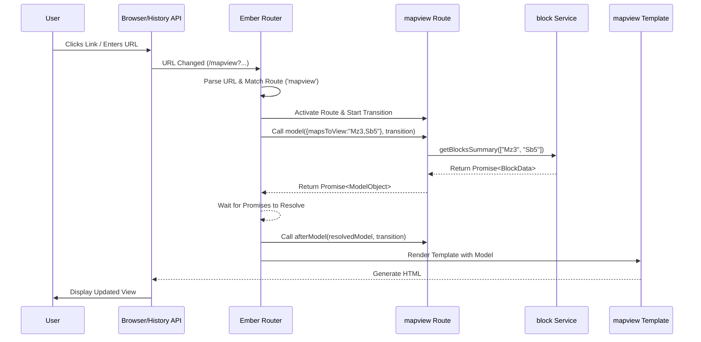

# Chapter 5: Ember Application & Router

In [Chapter 4: Ember Components (Drawing & UI Panels)](04_ember_components__drawing___ui_panels__.md), we explored how Pretzel uses modular components to build its user interface, from the main drawing canvas to individual UI panels. But how does the application start? How does it know which components to display based on the URL in the browser's address bar? How does it load the necessary data before showing a view?

## Motivation: Orchestrating the User Experience

Imagine you're visiting a large city (the Pretzel application). You need a starting point, a central hub (the Application object), and a reliable map and addressing system (the Router) to navigate between different districts and buildings (views or pages). Without this structure, the city would be chaotic and unusable.

The Ember Application and Router provide this essential structure for the Pretzel frontend:

1.  **Initialization:** Setting up the application environment, loading necessary configurations, and potentially initializing global services or event listeners.
2.  **Navigation:** Defining how different URLs map to specific states or views within the application.
3.  **Data Loading:** Ensuring that the required data for a specific view is fetched *before* the view is displayed.
4.  **State Management:** Representing the application's current state (which view is active, what data is loaded) often reflected in the URL.

Think of the Application object as the main city hall, responsible for overall setup, and the Router as the city planning department, defining the roads (URLs) and addresses that lead to specific buildings (Routes/Views).

**Our Central Use Case:** A user bookmarks or shares a URL like `http://pretzel.example.com/mapview?mapsToView=Mz3,Sb5`. When they navigate to this URL, Pretzel should load the main map view and automatically display Maize Chromosome 3 (Mz3) and Sorghum Chromosome 5 (Sb5) side-by-side, fetching the necessary block data first.

## Key Concepts: The Application's Foundation

1.  **Ember Application (`app/app.js`)**:
    *   **What it is:** The main entry point instance for the entire frontend application. It's created when the JavaScript bundle loads in the browser.
    *   **Role:** It bootstraps the application, loading configuration (`config/environment.js`), initializing the dependency injection container, setting up the Router, and loading initializers. It defines the application's namespace and resolver (how modules are found).
    *   **Analogy:** The city's incorporation charter and the central administration building where basic services are established.

2.  **Router (`app/router.js`)**:
    *   **What it is:** Defines the mapping between URL paths and Route handlers.
    *   **Role:** When the URL changes (due to navigation or initial load), the Router matches the path against its defined map and decides which Route should handle the request. It's like the city's official map, defining which address corresponds to which location.
    *   **Configuration:** The `Router.map` function defines the available routes and their URL structures, including dynamic segments (e.g., `:group_id`) and nested routes.

3.  **Route (`app/routes/*.js`)**:
    *   **What it is:** A JavaScript class responsible for handling a specific URL path defined in the Router.
    *   **Role:** Acts as the "building manager" for a specific address. Its primary responsibilities include:
        *   **Loading Data (`model` hook):** Fetching the necessary data (models) required for the route and its template. This hook often interacts with [Ember Services (API & State)](07_ember_services__api___state__.md) or the Ember Data store to retrieve data based on URL parameters. It typically returns a promise; Ember waits for the promise to resolve before proceeding.
        *   **Setting up Controllers:** Preparing the controller associated with the route, which manages the display logic and state for the template.
        *   **Rendering Templates:** Specifying which template should be rendered for this route.
    *   **Analogy:** The specific building or office you arrive at when you follow a road defined by the city planner. The manager here ensures the office is ready (data loaded) before you enter.

4.  **URL Parameters & Query Parameters**:
    *   **Dynamic Segments (e.g., `/group/:group_id`):** Parts of the URL path that represent dynamic values (like an ID). These are defined in `router.js` and are available as parameters in the Route's `model` hook. Analogy: The specific building number (e.g., `/office/123`).
    *   **Query Parameters (e.g., `?mapsToView=Mz3,Sb5&option=value`):** Key-value pairs appended to the URL after a `?`. Used for optional state, filtering, or configuration that doesn't define a fundamentally different resource. Defined in the Route file. Analogy: Additional instructions on the address (e.g., `?floor=3&department=planning`).

## Solving the Use Case: Navigating to `/mapview?mapsToView=Mz3,Sb5`

Let's trace how Pretzel handles this specific URL:

1.  **URL Change:** The browser navigates to `http://pretzel.example.com/mapview?mapsToView=Mz3,Sb5`.
2.  **Router Matching:** The Ember Router (`app/router.js`) recognizes the `/mapview` path.
    ```javascript
    // frontend/app/router.js (Simplified)
    import EmberRouter from '@ember/routing/router';
    import config from 'pretzel-frontend/config/environment';

    export default class Router extends EmberRouter {
      location = config.locationType; // e.g., 'history'
      rootURL = config.rootURL;       // e.g., '/'
    }

    Router.map(function() {
      // ... other routes like login, groups ...
      this.route('mapview'); // Defines the /mapview path
      // ...
    });
    ```
    *Explanation:* `this.route('mapview');` tells the Router that URLs matching `/mapview` should be handled by the `mapview` route.

3.  **Route Activation:** The Router activates the `mapview` route handler (`app/routes/mapview.js`).
4.  **Query Param Handling:** The `mapview` route defines `mapsToView` as a query parameter. Ember automatically makes its value (`"Mz3,Sb5"`) available.
    ```javascript
    // frontend/app/routes/mapview.js (Simplified Query Param Definition)
    import Route from '@ember/routing/route';
    import { inject as service } from '@ember/service';

    export default class MapviewRoute extends Route {
      @service queryParamsService; // Service to manage query params

      queryParams = {
        mapsToView: {
          refreshModel: false, // Change doesn't trigger full model reload
          replace: true       // Updates URL without new history entry
        },
        // ... other query params like 'chr', 'highlightFeature'
      };
      // ... model hook and other methods ...
    }
    ```
    *Explanation:* The `queryParams` object declares the query parameters this route recognizes. `mapsToView` is defined here.

5.  **Model Hook Execution:** Ember calls the `model(params, transition)` hook on the `mapview` route. The `params` object contains the values of any dynamic segments (none here) and query parameters.
    ```javascript
    // frontend/app/routes/mapview.js (Simplified model hook)
    import Route from '@ember/routing/route';
    import { inject as service } from '@ember/service';
    import RSVP from 'rsvp';

    export default class MapviewRoute extends Route {
      @service blockService; // Service to manage block data
      @service queryParamsService;
      @service apiServers;
      // ... other services

      queryParams = { /* ... as above ... */ };

      async model(paramsIn) {
        // 1. Update internal service with current query params
        let params = this.queryParamsService.get('params');
        Object.keys(paramsIn).forEach((key) => params.set(key, paramsIn[key]));

        // 2. Get the list of block IDs from the query param
        const blockIdsToView = params.mapsToView || [];
        console.debug('Loading blocks:', blockIdsToView);

        // 3. Fetch data for the requested blocks using a service
        //    (getBlocksSummary often fetches minimal data like feature counts)
        //    This returns a promise or task instance.
        let viewedBlocksPromise = RSVP.cast([]); // Default to empty promise
        if (blockIdsToView.length > 0) {
           // Filter out non-DB IDs if necessary
           const dbBlocksToView = blockIdsToView.filter(id => !id.includes('_'));
           if (dbBlocksToView.length > 0) {
              // Use a service to load data, returning a promise/task
              viewedBlocksPromise = this.blockService.getBlocksSummary(dbBlocksToView);
           }
        }

        // 4. Also fetch available datasets (might be needed for UI panels)
        let datasetsPromise = this.apiServers.primaryServer.getDatasets()
           .catch(err => { console.error(err); return []; });

        // 5. Return an object containing promises/data for the template/controller
        return RSVP.hash({
          params: params, // Pass resolved params
          availableMapsTask: datasetsPromise, // Available datasets
          viewedBlocks: viewedBlocksPromise,  // Promise for the blocks data
          viewedById: this.blockService.viewedById // Map of blocks being viewed
          // ... potentially other needed data like user settings ...
        });
      }
    }
    ```
    *Explanation:* The `model` hook accesses `params.mapsToView` (which holds `["Mz3", "Sb5"]` after potential processing). It uses the `blockService` (an [Ember Service](07_ember_services__api___state__.md)) to request the data for these blocks. It returns an `RSVP.hash` containing promises. Ember waits for these promises to resolve.

6.  **Data Resolution:** The `blockService` fetches the necessary [Block](01_ember_data_models__dataset__block__feature__.md) data, potentially from the backend API. Once the promises in `RSVP.hash` resolve, the data is available.
7.  **Template Rendering:** Ember renders the `mapview` template (`app/templates/mapview.hbs`), making the resolved model data available. [Ember Components](04_ember_components__drawing___ui_panels__.md) within the template (like `draw-map`) receive this data as arguments (e.g., `<DrawMap @model={{@model}} />`) and can then display the Mz3 and Sb5 axes and associated features.

The user now sees the map view with the requested chromosomes loaded, fulfilling the use case.

## Internal Implementation: Under the Hood

Let's trace the lifecycle from URL change to rendered view.

**Step-by-Step Flow:**

1.  **URL Change:** User clicks a `<LinkTo @route="mapview" @query={{hash mapsToView="Mz3,Sb5"}} />` component, types the URL, or uses browser back/forward buttons.
2.  **History API:** The browser's History API (or hash change mechanism, depending on `locationType`) updates the URL.
3.  **Ember Detection:** Ember's Router detects the URL change.
4.  **URL Parsing & Matching:** The Router parses the new URL (`/mapview?mapsToView=Mz3,Sb5`) and matches the path `/mapview` to the `mapview` route definition in `router.js`.
5.  **Transition Start:** A Route Transition begins.
6.  **Route Hooks:** Ember calls the relevant hooks on the `mapview` route:
    *   `beforeModel(transition)`: Opportunity to redirect or abort the transition early.
    *   `model(params, transition)`: Called to load data. `params` contains `{ mapsToView: "Mz3,Sb5" }`. The hook returns a promise (e.g., from `RSVP.hash`).
    *   `afterModel(resolvedModel, transition)`: Called after the `model` hook's promise resolves. Opportunity to perform actions based on the loaded data before setup.
7.  **Controller Setup:** Ember sets up the `mapview` controller (`app/controllers/mapview.js`), making the `resolvedModel` available to it.
8.  **Template Rendering:** Ember renders the `mapview` template (`app/templates/mapview.hbs`), providing the controller (and thus the model) as the rendering context. Components within the template receive the data.
9.  **DOM Update:** The rendered HTML is inserted into the DOM, displaying the view to the user.

**Sequence Diagram:**



**Code Snippets:**

*   **`app/app.js` (Entry Point):**
    ```javascript
    // frontend/app/app.js
    import Application from '@ember/application';
    import Resolver from 'ember-resolver';
    import loadInitializers from 'ember-load-initializers';
    import config from 'pretzel-frontend/config/environment';

    export default class App extends Application {
      modulePrefix = config.modulePrefix;
      podModulePrefix = config.podModulePrefix;
      Resolver = Resolver;
      // Custom global events can be defined if needed
      customEvents = { paste: "paste" };
    }

    loadInitializers(App, config.modulePrefix);
    ```
    *Explanation:* This boilerplate code defines the main Application class, sets up the module prefix and resolver, and loads any initializers defined in `app/initializers`. It's the foundation upon which everything else is built.

*   **`app/router.js` (URL Mapping):**
    ```javascript
    // frontend/app/router.js
    import EmberRouter from '@ember/routing/router';
    import config from 'pretzel-frontend/config/environment';

    export default class Router extends EmberRouter {
      location = config.locationType; // How URLs are handled (history, hash, none)
      rootURL = config.rootURL;       // Base URL if app is not at domain root
    }

    Router.map(function() {
      this.route('login');
      this.route('mapview'); // Route for the main visualization
      this.route('group', { path: '/group/:group_id' }, function() {
        // Nested routes, e.g., /group/123/edit
        this.route('edit');
      });
      // Fallback for unknown URLs
      this.route('404', { path: '/*wildcard' });
    });
    ```
    *Explanation:* `Router.map` defines the application's URL structure. `/mapview` maps to the `mapview` route. `/group/:group_id` defines a dynamic segment `:group_id`, whose value will be passed to the `group` route's `model` hook.

*   **`app/routes/application.js` (Top-Level Route):**
    ```javascript
    // frontend/app/routes/application.js (Simplified)
    import Route from '@ember/routing/route';
    import { inject as service } from '@ember/service';
    // Mixin for handling session events (authentication, invalidation)
    import ApplicationRouteMixin from '../utils/ember-simple-auth-mixin-replacements/application-route-mixin';

    export default class ApplicationRoute extends Route.extend(ApplicationRouteMixin) {
      @service session;
      @service sessionAccount; // Service to load user details

      // Default route to transition to after successful login
      routeAfterAuthentication = 'mapview';

      async beforeModel() {
        // Ensure session state is loaded (e.g., from localStorage)
        await this.session.setup();
        // Attempt to load current user info if session is authenticated
        return this._loadCurrentUser();
      }

      sessionAuthenticated() {
        // Called automatically by ember-simple-auth on login
        super.sessionAuthenticated(...arguments); // Handles transition
        this._loadCurrentUser().catch(() => this.session.invalidate());
      }

      _loadCurrentUser() {
        // Uses sessionAccount service to fetch user data from API
        return this.sessionAccount.loadCurrentUser();
      }
    }
    ```
    *Explanation:* The `application` route is the root route for the entire application. It often handles application-wide concerns like authentication state (`session`, `sessionAccount`) using hooks like `beforeModel` and event handlers like `sessionAuthenticated`. It ensures basic session setup occurs before any other route is loaded.

*   **`config/environment.js` (Configuration):**
    ```javascript
    // frontend/config/environment.js (Relevant parts)
    'use strict';

    module.exports = function (environment) {
      // ... other config ...
      const ENV = {
        // ...
        rootURL: process.env.ROOT_URL || '/', // Base path for the app
        // locationType: 'auto', // Deprecated, use 'history' or 'hash'
        locationType: 'history', // Use browser's History API for clean URLs
        // ...
        'ember-simple-auth' : {
            routeAfterAuthentication : 'mapview', // Default target after login
        },
        // ...
      };
      // ... environment-specific overrides (development, test, production) ...
      return ENV;
    };
    ```
    *Explanation:* This file configures the application environment. `locationType` specifies how Ember interacts with the browser's URL and history. `rootURL` is important if the app isn't served from the domain root (e.g., `example.com/pretzel/`). Configuration for addons like `ember-simple-auth` is also set here.

## Conclusion

The Ember Application object provides the initial bootstrapping and configuration context, while the Router acts as the crucial navigation system, mapping URLs to specific application states (Routes). Routes, in turn, are responsible for loading the necessary data (`model` hook) associated with a given URL (using dynamic segments and query parameters) before rendering the corresponding templates and components. This structured approach ensures a predictable flow for handling user navigation and loading data, forming the backbone of the Pretzel frontend application's user experience.

With the frontend's core structure established, we now turn our attention to the backend system that serves the data and handles application logic.

**Next:** [Chapter 6: Loopback Application & Server](06_loopback_application___server_.md)

---

Generated by [AI Codebase Knowledge Builder](https://github.com/The-Pocket/Tutorial-Codebase-Knowledge)