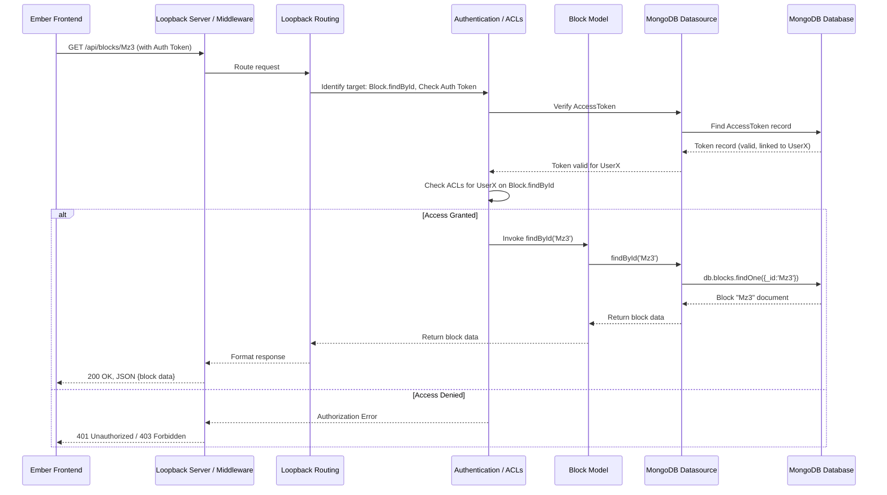

# Chapter 6: Loopback Application & Server

In [Chapter 5: Ember Application & Router](05_ember_application___router_.md), we explored how the Pretzel frontend application initializes, handles navigation using URLs, and loads data for specific views via Routes. But where does that data come from? How are requests authenticated, and how is business logic enforced? That's the responsibility of the backend API server.

## Motivation: The Central Processing Hub

Think of the Pretzel frontend as a sophisticated branch office, handling user interactions and displaying information. However, the core data storage, heavy processing, security enforcement, and business rule application happen at the main headquarters. This headquarters is the backend API server.

In Pretzel, this backend is built using the **Loopback** framework (specifically, a version likely based on Loopback 3, judging by the project structure). It needs to:

1.  **Listen for Requests:** Receive HTTP requests from the frontend (e.g., asking for data, asking to save data).
2.  **Authenticate & Authorize:** Verify the user's identity and check if they have permission to perform the requested action.
3.  **Interact with the Database:** Fetch, create, update, or delete records in the underlying database (e.g., MongoDB).
4.  **Apply Business Logic:** Execute custom code before or after database operations (e.g., validating data, triggering related actions).
5.  **Send Responses:** Format the requested data or confirmation messages and send them back to the frontend.

Without this central server, the frontend would have no persistent data storage, no secure way to manage users and permissions, and nowhere to perform complex operations.

**Our Central Use Case:** Let's follow a request originating from the frontend: The user is logged in and viewing the map. The Ember application needs to fetch details for a specific chromosome, "Mz3". It sends a `GET` request to the backend endpoint `/api/blocks/Mz3`. We need to understand how the Loopback server processes this request, verifies permissions, fetches the data from MongoDB, and returns it as JSON.

## Key Concepts: Inside the Loopback Server

Loopback provides a structured way to build REST APIs. Here are the key components in Pretzel's backend:

1.  **Loopback Framework (v3):** A Node.js framework designed for quickly building APIs and microservices. It provides conventions for defining models, connecting to data sources, and automatically exposing REST endpoints.

2.  **Application Structure:**
    *   `server/`: Contains server-specific configurations and boot scripts.
        *   `server.js`: The main entry point that boots the Loopback application.
        *   `datasources.json`/`.local.js`: Defines connections to databases (like MongoDB) and other services (like email). `.local.js` often uses environment variables for credentials.
        *   `model-config.json`/`.local.js`: Maps models to their respective data sources and configures which models are public (exposed via REST).
        *   `config.json`/`.local.js`: Configures settings like the REST API root path (`/api`), host, and port.
        *   `boot/`: Contains scripts that run during application startup (e.g., `authentication.js` to enable security features).
    *   `common/models/`: Defines the data models (e.g., `Dataset`, `Block`, `Feature`, `Client`, `Group`). These are covered in detail in [Chapter 8: Loopback Models](08_loopback_models__dataset__block__feature__client__group__.md).
    *   `common/mixins/`: Reusable logic that can be mixed into models.
    *   `common/utilities/`: Helper functions used across the backend (e.g., for ACL checks, identity management).

3.  **Request Lifecycle (Simplified):**
    *   HTTP request arrives (e.g., `GET /api/blocks/Mz3`).
    *   Middleware runs (e.g., logging (`morgan`), body parsing, potentially custom middleware).
    *   Loopback routing determines the target model (`Block`) and method (e.g., `findById`).
    *   Authentication middleware verifies the access token (if provided).
    *   Authorization (ACLs - Access Control Lists) checks if the requesting user/role has permission for the `Block.findById` operation.
    *   Model operation hooks (e.g., `before save`, `after find`) can execute custom logic.
    *   The model interacts with its configured Datasource (e.g., MongoDB adapter) to perform the database query.
    *   The Datasource returns the result to the model.
    *   The result is formatted (usually as JSON) and sent back as the HTTP response.

4.  **Data Sources (`datasources.local.js`):** Define *how* Loopback connects to external systems. Pretzel primarily uses a MongoDB datasource (`mongoDs`) for its main database and potentially an email datasource for notifications. Configuration details like host, port, database name, and credentials are often managed via environment variables for security and flexibility.

5.  **Models (`model-config.local.js`):** Define *what* data the application works with. The `model-config` file links these models (defined in `common/models/`) to specific data sources and specifies whether they should be exposed publicly via the REST API (`"public": true`).

6.  **Boot Scripts (`server/boot/`):** JavaScript files executed when the server starts. They are used for initialization tasks, such as enabling authentication (`authentication.js`), setting up cron jobs, or registering custom routes.

7.  **Middleware:** Functions that process requests before they reach the main route handlers. Loopback uses standard Express-style middleware. Pretzel uses `morgan` for request logging and `body-parser` for handling request bodies. Loopback's built-in authentication and ACL system also function as middleware.

## Solving the Use Case: Handling `GET /api/blocks/Mz3`

Let's trace how the Loopback server handles the request for Block "Mz3":

1.  **Request Received:** The Node.js server receives the `GET /api/blocks/Mz3` request.
2.  **Middleware:** Standard middleware like `morgan` (logging) and potentially others run.
3.  **Routing:** Loopback's REST connector identifies `/api` as the API root (from `config.local.js`). It parses `/blocks/Mz3` and maps it to the `Block` model's built-in `findById` remote method, with `Mz3` as the ID parameter.
4.  **Authentication:** Loopback's authentication middleware checks for an access token in the request headers (usually `Authorization: <token>`). If found, it validates the token against the `AccessToken` model (stored in `mongoDs`) and identifies the associated `Client` (user). If no token is needed or it's valid, processing continues.
5.  **Authorization (ACLs):** The ACL system checks the rules defined for the `Block` model (often configured via `Block.json` or dynamically via roles). It determines if the identified user (or the `$everyone` role if unauthenticated) has `READ` permission for the `findById` method. Pretzel uses roles like `viewer` and `editor` and checks ownership (`clientId`) or group membership (`groupId`) as defined in `common/utilities/identity.js` and `common/utilities/acl.js`. See [Chapter 9: Authentication & Authorization](09_authentication___authorization_.md) for details. If permission is denied, a 401/403 error is sent.
6.  **Model Operation:** If authorized, the `Block.findById('Mz3')` method is invoked.
7.  **Datasource Interaction:** The `Block` model uses the `mongoDs` datasource configuration (`datasources.local.js`) to connect to the MongoDB database. The Loopback MongoDB connector translates the `findById` call into a MongoDB query (e.g., `db.blocks.findOne({ _id: 'Mz3' })` or `db.blocks.findOne({ name: 'Mz3' })` if `name` is configured as the ID).
8.  **Database Query:** MongoDB executes the query and returns the document for "Mz3".
9.  **Data Return:** The MongoDB connector returns the data to the `Block` model.
10. **Response:** Loopback formats the `Block` data as a JSON object and sends it back to the Ember frontend with a `200 OK` status code.

## Internal Implementation: Under the Hood

Let's look at how the server starts and how configurations connect these pieces.

**Server Startup (`server/server.js`):**

1.  **Environment Variables:** `dotenv` loads environment variables from `.env` file (if configured), allowing sensitive data like database passwords to be kept out of source control. `server.js` logs these for debugging.
2.  **Loopback Initialization:** `loopback()` creates the application instance.
3.  **Middleware Setup:** Basic middleware like `morgan` for logging is applied (`app.use(morgan(...))`). Body parser limits are also configured (though commented out in the snippet, they exist in `config.local.js`).
4.  **Boot Process:** `boot(app, __dirname, ...)` is the core initialization step. It loads all configurations:
    *   Reads `datasources.local.js` to configure database connections.
    *   Reads `model-config.local.js` to discover models and link them to datasources.
    *   Reads `config.local.js` for host, port, API path.
    *   Executes all scripts in the `server/boot/` directory (like `authentication.js`).
5.  **Start Listening:** `app.start()` initiates the Node.js HTTP server, making it listen on the configured port (from `config.local.js` or environment variable `API_PORT_EXT`). It logs messages indicating the server is ready.

**Sequence Diagram (Use Case: `GET /api/blocks/Mz3`)**



**Code Snippets:**

*   **`server.js` (Simplified Startup)**
    ```javascript
    // lb4app/lb3app/server/server.js (Simplified)
    'use strict';
    const dotenv = require('dotenv').config(/* options */); // Load .env
    var loopback = require('loopback');
    var boot = require('loopback-boot');
    var morgan = require('morgan'); // Logging middleware

    var app = module.exports = loopback();

    app.start = function() {
      // start the web server
      return app.listen(function() {
        app.emit('started');
        var baseUrl = app.get('url').replace(/\/$/, '');
        console.log('Web server listening at: %s', baseUrl);
        // ... log API explorer path ...
      });
    };

    // Add logging middleware (skip in test environment)
    if (process.env.NODE_ENV != 'test') {
      app.use(morgan('combined'));
    }

    // Bootstrap the application: models, datasources, middleware, boot scripts
    boot(app, __dirname, function(err) {
      if (err) throw err;
      // Start the server if running as main module
      if (require.main === module)
        app.start();
    });
    ```
    *Explanation:* This file sets up the core Loopback app, adds logging, and crucially calls `boot()` which reads configuration files and runs boot scripts to initialize everything before starting the HTTP listener via `app.start()`.

*   **`datasources.local.js` (MongoDB Connection)**
    ```javascript
    // lb4app/lb3app/server/datasources.local.js (Simplified)
    'use strict';
    /* global process */
    const database = process.env.DB_NAME || 'pretzel';

    var config = {
      "db": { // Default in-memory DB (rarely used)
        "name": "db",
        "connector": "memory"
      },
      "mongoDs": { // Main MongoDB connection
        "host": process.env.DB_HOST,
        "port": process.env.DB_PORT,
        "database": database,
        "authSource": database, // Usually the same as database
        "password": process.env.DB_PASS, // From environment variable
        "name": "mongoDs",
        "user": process.env.DB_USER,     // From environment variable
        "connector": "mongodb",
        "connectionTimeoutMS": 1800000, // Long timeouts
        "socketTimeoutMS": 1800000
      },
      // ... email datasource config ...
    };
    module.exports = config;
    ```
    *Explanation:* This defines the connection parameters for named data sources. `mongoDs` specifies the connector type (`mongodb`) and connection details pulled from environment variables (`process.env.DB_HOST`, etc.) for security and configurability.

*   **`model-config.local.js` (Linking Models to Datasource)**
    ```javascript
    // lb4app/lb3app/server/model-config.local.js (Simplified)
    'use strict';
    var config = {
      "_meta": { /* Specifies where model definitions are found */ },
      "User": { "dataSource": "mongoDs", "public": false },
      "Client": { "dataSource": "mongoDs", "public": true }, // Expose Client model via REST
      "Group": { "dataSource": "mongoDs", "public": true },
      "AccessToken": { "dataSource": "mongoDs", "public": false }, // Internal use mostly
      "ACL": { "dataSource": "mongoDs", "public": false },
      "RoleMapping": { "dataSource": "mongoDs", "public": false },
      "Role": { "dataSource": "mongoDs", "public": false },
      "Dataset": { "dataSource": "mongoDs", "public": true }, // Expose Dataset via REST
      "Block": { "dataSource": "mongoDs", "public": true },   // Expose Block via REST
      "Feature": { "dataSource": "mongoDs", "public": true }, // Expose Feature via REST
      // ... other models ...
      "Email": { "dataSource": "email" }, // Uses email datasource
    };
    module.exports = config;
    ```
    *Explanation:* This file tells Loopback which datasource each model should use (`"dataSource": "mongoDs"`) and whether the model's built-in CRUD REST endpoints should be automatically exposed (`"public": true`). Models like `Block`, `Dataset`, and `Feature` are public, while internal models like `AccessToken` or `ACL` are not directly accessible via the default REST API routes.

*   **`boot/authentication.js` (Conditional Auth)**
    ```javascript
    // lb4app/lb3app/server/boot/authentication.js
    'use strict';

    module.exports = function enableAuthentication(server) {
      // enable authentication based on environment variable
      if (process.env.AUTH !== 'NONE') {
        server.enableAuth(); // Enables Loopback's built-in auth system
      }
    };
    ```
    *Explanation:* A simple boot script that checks an environment variable (`AUTH`). If authentication is not explicitly disabled (`NONE`), it calls `server.enableAuth()` to activate Loopback's authentication and ACL features.

*   **`common/utilities/identity.js` (Finding User & Checking Permissions - Conceptual)**
    ```javascript
    // lb4app/lb3app/common/utilities/identity.js (Simplified Concept)
    'use strict';
    var clientGroups = require('./client-groups'); // Utility to get group memberships

    // Finds the logged-in user's ID from the request context
    exports.gatherClientId = (ctx) => {
      const accessToken = ctx.options?.accessToken || ctx.accessToken;
      return accessToken ? String(accessToken.userId) : null;
    };

    // Modifies the query (ctx.query) to only return accessible items
    exports.queryFilterAccessible = (ctx) => {
      let clientId = exports.gatherClientId(ctx);
      let groups = clientGroups.clientGroups.getClientGroups(clientId); // Get groups user is in

      let where = { or: [ { public: true } ] }; // Start with public items
      if (clientId) {
        where.or.push({ clientId: clientId }); // Add items owned by the user
        if (groups?.length) {
           // Add items shared via groups the user belongs to
           where.or.push({ groupId: { inq: groups } }); // 'inq' for 'in query'
        }
      }

      // Combine with existing query filters if any
      ctx.query = ctx.query || {};
      ctx.query.where = ctx.query.where ? { and: [where, ctx.query.where] } : where;
    };
    ```
    *Explanation:* These utility functions are crucial for implementing authorization. `gatherClientId` extracts the user ID from the request's access token. `queryFilterAccessible` dynamically constructs a database query filter (`where` clause) based on the user's ID and their group memberships, ensuring that read operations only return records the user is allowed to see (their own, public, or shared via groups). This logic is often applied using Loopback's operation hooks or custom middleware/ACL resolvers. See [Chapter 9: Authentication & Authorization](09_authentication___authorization_.md).

## Conclusion

The Loopback application server acts as the central nervous system and persistent memory for Pretzel. It provides the REST API that the [Ember Application & Router](05_ember_application___router_.md) consumes, handles data requests, enforces security rules through authentication and ACLs ([Chapter 9](09_authentication___authorization_.md)), interacts with the MongoDB database via configured data sources, and executes business logic. Understanding its structure, configuration files (`server.js`, `datasources.local.js`, `model-config.local.js`), and the request lifecycle is key to grasping how data flows between the frontend and the backend database.

Now that we've seen the backend server structure, let's look at how the frontend application organizes its communication with this API and manages its internal state using Ember Services.

**Next:** [Chapter 7: Ember Services (API & State)](07_ember_services__api___state__.md)

---

Generated by [AI Codebase Knowledge Builder](https://github.com/The-Pocket/Tutorial-Codebase-Knowledge)