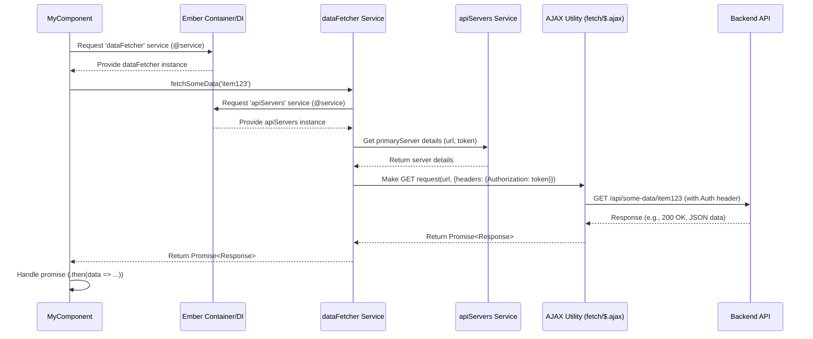

# Chapter 7: Ember Services (API & State)

In [Chapter 6: Loopback Application & Server](06_loopback_application___server_.md), we explored the Pretzel backend, the central hub that serves data and enforces logic via an API. Now, how does the frontend application consistently interact with this API? How does it manage application-wide state like user login details, UI control settings, or cached data that needs to be accessed from various parts of the interface?

## Motivation: Centralizing Functionality and State

Imagine the Pretzel frontend application as a large, complex office building. Different departments (components, routes) need access to shared resources and information.

*   **Security Desk:** Needs to know who is logged in and manage authentication (`session`, `session-account`).
*   **Communication Lines:** A standardized way to talk to the outside world (the backend API) is required (`auth`, `apiServers`).
*   **Central Filing/Cache:** Efficiently storing and retrieving frequently used data (like block or feature details) to avoid repeated lookups (`data/*` services).
*   **Building Control Room:** Managing shared UI settings or states that affect multiple areas, like global zoom levels, selected themes, or active filters (`controls`, `query-params`).

Instead of each department building its own communication lines or maintaining its own security log, it's far more efficient and consistent to have central utility providers. In Ember, these providers are called **Services**. They are long-lived objects (singletons) accessible throughout the application, perfect for managing shared state or providing reusable functionality.

**Our Central Use Case:** When a user logs in, their authentication token and user ID need to be stored securely. This information must be readily available to various parts of the application, such as components that need to make authenticated API calls or display the user's name. Furthermore, we need a centralized way to make authenticated requests to the backend API (e.g., fetching block data) without repeating the logic for adding authentication headers in every component.

## Key Concepts: The Utility Providers

1.  **Singleton Nature:** An Ember Service is instantiated only once per application session. This makes it ideal for holding state because multiple parts of the application can access the *same instance* and thus the same data.
2.  **Dependency Injection (`@service`):** Components, routes, controllers, and even other services can easily get access to a service instance using the `@service` decorator (or `inject as service` in older Ember syntax). Ember's container handles finding or creating the service instance.
    ```javascript
    // Example: Injecting the 'session' service into a component
    import Component from '@glimmer/component';
    import { inject as service } from '@ember/service';

    export default class MyComponent extends Component {
      @service session; // Injects the 'session' service instance

      get isAuthenticated() {
        return this.session.isAuthenticated; // Access service properties
      }
    }
    ```
    *Explanation:* The `@service session;` line tells Ember to make the singleton instance of the `session` service available as `this.session` within the component.

3.  **Long-Lived:** Services persist for the lifetime of the application session, unlike components or routes which are created and destroyed during navigation or rendering changes. This allows them to maintain state across different user interactions and views.
4.  **State Management (`@tracked`):** Services can use Ember's `@tracked` properties to hold state. When this state changes, any part of the application observing these properties will automatically update.
5.  **Functionality Provider:** Services encapsulate logic, such as API communication, data processing, or complex calculations, making this logic reusable and testable in isolation.

## Categories of Services in Pretzel

Pretzel utilizes services for various purposes:

*   **Authentication & Session:**
    *   `session`: Manages the core authentication state (e.g., `isAuthenticated`), provided by the `ember-simple-auth` addon.
    *   `session-account`: Loads and holds details about the currently logged-in user ([Client](08_loopback_models__dataset__block__feature__client__group_.md) model). See `frontend/app/services/session-account.js`.
    *   `pretzel-local` (Authenticator): Handles the specific logic of communicating with the Pretzel backend's `/Clients/login` endpoint. See `frontend/app/authenticators/pretzel-local.js`.
*   **API Interaction:**
    *   `apiServers`: Manages connections to potentially multiple backend API endpoints, including storing tokens and constructing base URLs. It holds the primary connection details used by other services. See `frontend/app/services/api-servers.js`.
    *   `auth` (Often implicitly used via `apiServers` or specific data services): While not a distinct service in the provided code, the pattern involves services like `apiServers` or data services using the `session` service's token to make authenticated AJAX calls. The `pretzel-local` authenticator service handles the initial login request.
*   **Application State & UI Controls:**
    *   `controls`: A central registry for global UI states and settings (e.g., genotype filters, UI modes). See `frontend/app/services/controls.js`.
    *   `queryParams`: Manages the state represented in the URL query parameters, syncing them with application state. See `frontend/app/services/query-params.js`.
*   **Data Fetching & Caching (`data/*`):**
    *   `data/block`: Manages fetching, caching, and providing access to [Block](01_ember_data_models__dataset__block__feature__.md) data.
    *   `data/trait`: Manages state related to QTL traits, like visibility. See `frontend/app/services/data/trait.js`.
    *   `data/axis-brush`: Manages the state of brushed (selected) regions on axes. See `frontend/app/services/data/axis-brush.js`.
    *   `data/block-values`: Collates and processes specific values (like Ontologies) from blocks. See `frontend/app/services/data/block-values.js`.
*   **Other Utilities:**
    *   `feed`: A simple event bus service for cross-component communication. See `frontend/app/services/feed.js`.
    *   `store`: The standard Ember Data store service for interacting with [Ember Data Models](01_ember_data_models__dataset__block__feature__.md).

## Solving the Use Case: Managing Session and API Calls

Let's address the use case: Storing login info and making authenticated API calls.

1.  **Login:**
    *   A login component uses the `session` service's `authenticate` method, passing the specific authenticator (`'authenticator:pretzel-local'`) and credentials.
    *   The `pretzel-local` authenticator (`frontend/app/authenticators/pretzel-local.js`) makes an AJAX POST request to `/api/Clients/login`.
    *   If successful, the backend returns a token (`id`) and user ID (`userId`).
    *   The authenticator resolves its promise with `{ token: response.id, clientId: response.userId }`.
    *   `ember-simple-auth`'s `session` service stores this data (usually in `localStorage`).
    *   The authenticator also calls `apiServers.addServer(...)` to store the token and client ID associated with the API host, marking it as the primary server.
    *   The `sessionAccount` service's `loadCurrentUser` method is triggered (often in the [Application Route](05_ember_application___router_.md)'s `sessionAuthenticated` hook) to fetch the user's full [Client](08_loopback_models__dataset__block__feature__client__group_.md) details using the stored `clientId` and the Ember Data `store` service.
    *   The `session.isAuthenticated` property becomes `true`.

2.  **Authenticated API Call (e.g., Fetching Blocks):**
    *   A route or component needs to fetch block data (e.g., using the `data/block` service).
    *   The `data/block` service needs to make an API call (e.g., to `/api/blocks?filter=...`).
    *   It injects the `apiServers` service (`@service apiServers`).
    *   It retrieves the primary server details: `this.apiServers.primaryServer`.
    *   This `primaryServer` object (managed by `apiServers`) contains the base URL and the stored authentication `token`.
    *   The service constructs the full API URL and uses the token to make an authenticated AJAX request (usually by setting the `Authorization` header). Helper functions within `apiServers` or related utilities likely abstract this AJAX call.
    *   Any component needing authentication status simply injects `@service session` and checks `this.session.isAuthenticated`.

## Internal Implementation: Under the Hood

**How Services are Instantiated and Injected:**

1.  **Lookup:** When `@service myService` is encountered, Ember's container/resolver looks for `app/services/my-service.js`.
2.  **Instantiation (Lazy):** If an instance of `MyService` doesn't exist yet, Ember creates one by calling its `create()` method (behind the scenes).
3.  **Caching:** The instance is stored in the application's container.
4.  **Injection:** The requesting object (component, route, etc.) gets a reference to this single instance.
5.  **Reuse:** Subsequent requests for `myService` receive the *same* cached instance.

**Step-by-Step: Component Using a Service for API Call**

Let's imagine a component fetching data using a hypothetical `dataFetcher` service which uses `apiServers`.

1.  **Component Needs Data:** `MyComponent` needs data.
2.  **Inject Service:** `MyComponent` has `@service dataFetcher;`. Ember provides the singleton instance.
3.  **Call Service Method:** The component calls `this.dataFetcher.fetchSomeData('item123')`.
4.  **Service Injects Service:** `DataFetcherService` has `@service apiServers;`. Ember provides the instance.
5.  **Service Logic:**
    *   `dataFetcher` gets the primary API server details: `let server = this.apiServers.primaryServer;`.
    *   It gets the token and base URL from `server`.
    *   It constructs the full URL: `let url = `${server.url}/api/some-data/item123`;`.
    *   It makes an AJAX call using `fetch` or `$.ajax`, adding the `Authorization: server.token` header.
6.  **Return Promise:** The AJAX call returns a promise. `dataFetcher` returns this promise to the component.
7.  **Component Handles Response:** `MyComponent` uses `.then()` and `.catch()` on the promise to handle the data or errors.

**Sequence Diagram:**



**Code Snippets:**

*   **Defining a Service (`apiServers`)**
    ```javascript
    // frontend/app/services/api-servers.js (Simplified)
    import Service from '@ember/service';
    import { A } from '@ember/array';
    import { tracked } from '@glimmer/tracking';
    import ApiServer from '../utils/api-server'; // Utility class to hold server details

    export default class ApiServersService extends Service {
      @tracked servers = A([]); // Tracked array of ApiServer instances

      get primaryServer() {
        // Pretzel logic often assumes the first server added is primary
        return this.servers.get('firstObject');
      }

      get serversLength() {
        return this.servers.length;
      }

      addServer(name, url, user, token, clientId) {
        const server = ApiServer.create({ name, url, user, token, clientId, owner: this });
        this.servers.pushObject(server);
        // primaryServer is implicitly updated due to tracking servers array
        return server;
      }

      lookupServerName(name) {
         return this.servers.findBy('name', name);
      }
      // ... methods to make requests using server details ...
    }
    ```
    *Explanation:* This service manages a `@tracked` array of `ApiServer` objects. `addServer` adds a new backend connection, storing its URL and token. `primaryServer` provides easy access to the main backend. Components observing `servers` or `primaryServer` will update if the list changes.

*   **Defining a State Service (`controls`)**
    ```javascript
    // frontend/app/services/controls.js (Simplified)
    import Service from '@ember/service';
    import Evented from '@ember/object/evented';
    import { tracked } from '@glimmer/tracking';

    export default class ControlsService extends Service.extend(Evented) {
      @tracked userSettings = { // Example tracked state object
        genotype: {
          mafThreshold: 0.05,
          typeSNP: true,
        },
        // ... other settings ...
      };

      @tracked guiMode = undefined; // e.g., 'bucketFill' or undefined

      // Method to update state
      setGuiMode(mode) {
        this.guiMode = mode;
        this.trigger('guiModeChanged', mode); // Trigger event if needed
      }

      // Computed property based on state
      get snpFiltersActive() {
        // logic to check if current userSettings.genotype values represent active filters
        return this.userSettings.genotype.mafThreshold > 0 || /* ... */;
      }
    }
    ```
    *Explanation:* This service uses `@tracked` properties (`userSettings`, `guiMode`) to hold application state. Changes to these properties will cause dependent UI parts (that inject `controls` and access these properties) to re-render automatically.

*   **Using a Service in a Component**
    ```javascript
    // frontend/app/components/my-feature-display.js (Simplified)
    import Component from '@glimmer/component';
    import { inject as service } from '@ember/service';
    import { action } from '@ember/object';

    export default class MyFeatureDisplay extends Component {
      @service controls; // Inject the controls service
      @service dataFetcher; // Inject a hypothetical data service

      get displayColor() {
        // Use state from the controls service
        return this.controls.userSettings.featureColor || '#000000';
      }

      @action
      async refreshData() {
        try {
          let data = await this.dataFetcher.fetchSomeData(this.args.featureId);
          // ... use data ...
        } catch (error) {
          console.error("Failed to fetch data:", error);
        }
      }
    }
    ```
    *Explanation:* This component injects the `controls` and `dataFetcher` services. It uses `controls.userSettings` to affect rendering (`displayColor`) and calls `dataFetcher.fetchSomeData` to trigger an API call via the service.

## Conclusion

Ember Services are the backbone of Pretzel's frontend architecture for managing shared concerns. They act as central, long-lived providers for API interactions (`apiServers`), authentication (`session`, `session-account`), application-wide state (`controls`, `queryParams`), and data fetching/caching (`data/*`). By using dependency injection (`@service`), different parts of the application can easily access these shared resources and functionalities, leading to a more organized, maintainable, and testable codebase. They are the essential utilities that keep the complex "building" of the Pretzel frontend running smoothly.

Having explored both the frontend's structure ([Components](04_ember_components__drawing___ui_panels__.md), [Application/Router](05_ember_application___router_.md), Services) and the backend server ([Loopback](06_loopback_application___server_.md)), we'll now dive deeper into how the backend specifically defines its data structures.

**Next:** [Chapter 8: Loopback Models (Dataset, Block, Feature, Client, Group)](08_loopback_models__dataset__block__feature__client__group__.md)

---

Generated by [AI Codebase Knowledge Builder](https://github.com/The-Pocket/Tutorial-Codebase-Knowledge)