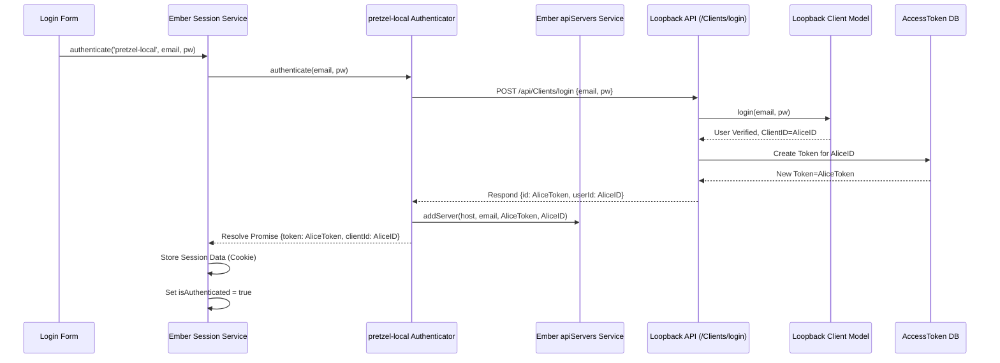
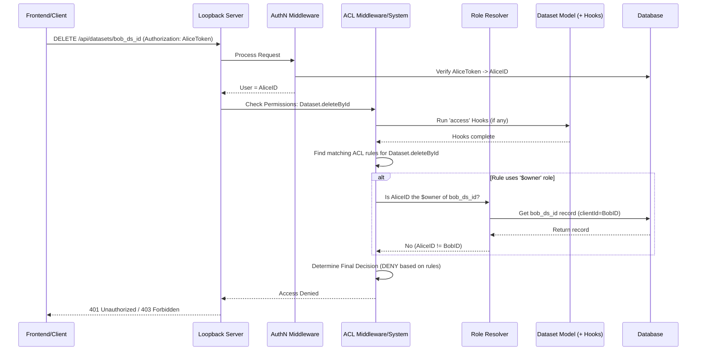

# Chapter 9: Authentication & Authorization

In [Chapter 8: Loopback Models (Dataset, Block, Feature, Client, Group)](08_loopback_models__dataset__block__feature__client__group__.md), we defined the blueprints for the data managed by the Pretzel backend, such as Datasets, Blocks, and user Clients. But just having data definitions isn't enough; we need robust mechanisms to ensure only the right people can access or modify this data. How does Pretzel verify who a user is, and how does it enforce permissions based on their identity and roles?

## Motivation: Securing the Data Warehouse

Imagine the Pretzel backend is a secure data warehouse. Before anyone can enter or interact with the stored information (Datasets, Blocks, etc.), two things must happen:

1.  **ID Check (Authentication):** The system needs to verify the identity of the user trying to gain access. Are they really who they claim to be? This usually involves checking credentials like a username and password.
2.  **Permission Check (Authorization):** Once identified, the system must determine what actions this specific user is allowed to perform. Can they view certain records? Can they modify or delete them? Do they have access based on ownership or group membership?

Without these checks, the data warehouse would be insecure, allowing anyone to view sensitive information or make unauthorized changes. Authentication acts as the security guard checking IDs at the door, while authorization is the system ensuring people only access the areas and perform the actions they are permitted to.

**Our Central Use Case:** A logged-in user, "Alice," attempts to delete a `Dataset` created by another user, "Bob." While the frontend UI might hide the delete button based on ownership information it has, the critical enforcement must happen on the backend. We need to understand how the backend API request (`DELETE /api/datasets/{bob_dataset_id}`) is intercepted and denied because Alice is not the owner and doesn't have specific administrative rights.

## Key Concepts: The Security System

Pretzel employs a two-pronged approach involving both the frontend and backend:

1.  **Authentication (Frontend Focus with Backend Verification):**
    *   **Frontend (`ember-simple-auth`):** The Ember frontend uses the `ember-simple-auth` library to manage the user's session state. It doesn't *store* passwords but handles the login flow.
    *   **Custom Authenticator (`pretzel-local`):** A custom authenticator (`frontend/app/authenticators/pretzel-local.js`) is configured to communicate with the Pretzel backend's specific login endpoint (`/api/Clients/login`). See [Chapter 7: Ember Services (API & State)](07_ember_services__api___state__.md).
    *   **Backend Verification:** The Loopback backend receives the credentials, verifies them against the `Client` model ([Chapter 8](08_loopback_models__dataset__block__feature__client__group_.md)), and issues a temporary access token upon success.
    *   **Token Storage:** `ember-simple-auth` securely stores this token (e.g., in a cookie via `frontend/app/session-stores/application.js`) and uses it for subsequent requests.
    *   **Custom Authorizer:** An authorizer (`frontend/app/authorizers/application.js`) ensures this token is added to the `Authorization` header of outgoing API requests.

2.  **Authorization (Backend Focus with Frontend Hints):**
    *   **Backend (Loopback ACLs):** This is the primary enforcement point. Loopback's Access Control List (ACL) system defines permissions for models and methods. ACL rules specify *who* (principal: user ID, role like `$owner`, `$everyone`, `editor`, `viewer`) can do *what* (method: `READ`, `WRITE`, specific remote methods like `create`, `deleteById`) on *which* resources (model: `Dataset`, `Block`). These rules are defined in the model's `.json` file (e.g., `common/models/dataset.json`).
    *   **Roles:** Loopback allows defining roles (like `viewer`, `editor`). Users (`Client` models) are assigned roles, often dynamically based on context (e.g., `$owner` role for the record's creator). Pretzel uses custom role resolvers or hooks to determine roles based on `clientId` (ownership) and `groupId` (group membership).
    *   **Ownership & Groups (`identity.js`):** Custom logic, often placed in operation hooks (`observe('access')`) or utility functions (`common/utilities/identity.js`, `common/utilities/acl.js`), checks the `clientId` and `groupId` properties on records against the requesting user's ID and group memberships to enforce fine-grained access control.
    *   **Frontend Hints:** The frontend can use information from the `session` service ([Chapter 7](07_ember_services__api___state__.md)) and computed properties on models (like the `owner` property derived from `clientId`, see [Chapter 1: Ember Data Models](01_ember_data_models__dataset__block__feature__.md)) to *conditionally render* UI elements (like showing/hiding a delete button). However, this is just a usability enhancement; the backend ACLs provide the actual security guarantee.

## Solving the Use Case: Preventing Unauthorized Deletion

Let's trace how Pretzel prevents Alice from deleting Bob's dataset:

1.  **Frontend (UI Hint):**
    *   Alice is logged in. The `session` service holds her token and `clientId`.
    *   When displaying the dataset list, the frontend loads [Dataset](01_ember_data_models__dataset__block__feature__.md) models, which include the `clientId` property.
    *   A computed property (e.g., `isOwner`) on the frontend `Dataset` model compares `dataset.clientId` with `session.data.authenticated.clientId`.
    *   The component rendering the delete button for Bob's dataset checks `dataset.isOwner`. Since it's false for Alice, the component might hide or disable the delete button. `{{#if dataset.isOwner}}<button ...>Delete</button>{{/if}}`

2.  **Backend (API Enforcement):**
    *   Even if Alice bypassed the UI restriction (e.g., by crafting an HTTP request directly), she sends `DELETE /api/datasets/{bob_dataset_id}` with her valid authentication token.
    *   **Authentication:** The Loopback server receives the request. The authentication middleware validates Alice's token and identifies her `clientId`.
    *   **Routing:** The request is routed to the `Dataset` model's `deleteById` method.
    *   **ACL Check:** Loopback's ACL system kicks in. It checks the ACL rules defined in `common/models/dataset.json` (or applied via `acl.js` utilities).
        *   A typical rule might deny `$everyone` all access.
        *   Another rule might grant `WRITE` access (which includes delete) only to the `$owner` role or perhaps an `admin` role.
        *   Loopback's role resolver determines if Alice matches the required role for deleting this specific dataset instance. Since `bob_dataset_id`'s `clientId` does not match Alice's `clientId`, she doesn't qualify for the `$owner` role in this context.
        *   Operation hooks (`observe('access')` or `before delete`) might contain additional checks using `identity.js` to verify `clientId`.
    *   **Denial:** Because no ACL rule grants Alice permission to delete this specific dataset, the ACL system denies the request.
    *   **Response:** The Loopback server sends back an error response, typically `401 Unauthorized` or `403 Forbidden`, preventing the deletion.

The backend ACLs provide the definitive security, ensuring that even if the frontend UI hints are bypassed, unauthorized actions are blocked.

## Internal Implementation: Under the Hood

### Authentication Flow

1.  **Login Attempt:** User enters credentials in the Ember login form. The form action calls `this.session.authenticate('authenticator:pretzel-local', email, password)`.
2.  **Authenticator Request:** The `pretzel-local` authenticator sends a POST request to `/api/Clients/login` with the credentials.
3.  **Backend Verification:** Loopback's `Client.login` method verifies credentials against the database.
4.  **Token Issuance:** If valid, the backend creates an `AccessToken` record (linking token ID, TTL, and `clientId`) and returns the token ID and `clientId` to the authenticator.
5.  **Authenticator Success:** The `pretzel-local` authenticator receives the token and `clientId`. It resolves its promise with this data. It also calls `apiServers.addServer` to store the token alongside the API host details ([Chapter 7](07_ember_services__api___state__.md)).
6.  **Session Update:** `ember-simple-auth`'s `session` service receives the data, stores it persistently (e.g., in a cookie), and sets `isAuthenticated` to `true`. The `ApplicationRoute`'s `sessionAuthenticated` hook often triggers `sessionAccount.loadCurrentUser` to fetch full user details.
7.  **Subsequent Requests:** The `application` authorizer injects the stored token into the `Authorization` header of all subsequent API requests made via services that use it (like `apiServers` or data services).

**Sequence Diagram (Login):**



**Code Snippets (Authentication):**

*   `pretzel-local` Authenticator (Handles API communication):
    ```javascript
    // frontend/app/authenticators/pretzel-local.js (Simplified authenticate method)
    import Base from 'ember-simple-auth/authenticators/base';
    import { inject as service } from '@ember/service';
    import $ from 'jquery';
    import { Promise } from 'rsvp';
    // ... other imports

    export default Base.extend({
      apiServers: service(),

      authenticate: function(identification, password) {
        // ... get endpoint URL ...
        let apiServers = this.get('apiServers');
        return new Promise((resolve, reject) => {
          $.ajax({ /* POST request to /api/Clients/login */ })
            .then(function(response){ // Success
              // ... get API host ...
              // Store token with apiServers service
              apiServers.addServer(host, identification, response.id, response.userId);
              // Resolve for ember-simple-auth
              resolve({ token: response.id, clientId: response.userId });
            }, function(xhr){ // Failure
              reject(xhr.responseText || 'Login failed');
            });
        });
      },
      // ... restore, invalidate methods ...
    });
    ```
    *Explanation:* Sends credentials to the backend, on success stores the received token using the `apiServers` service, and resolves the promise for `ember-simple-auth`.

*   `application` Authorizer (Adds token to requests):
    ```javascript
    // frontend/app/authorizers/application.js (Simplified)
    import BaseAuthorizer from 'ember-simple-auth/authorizers/base';
    import { inject as service } from '@ember/service';

    export default BaseAuthorizer.extend({
      session: service('session'),

      authorize(sessionData, block) {
        // Get token from primary server stored during authentication
        // The 'requestServer' might be set on the session by the calling service
        let server = this.get('session.requestServer');
        let token = server?.token || sessionData.token; // Fallback if needed

        if (token) {
          // Add 'Authorization' header to the request
          block('Authorization', token);
        }
      }
    });
    ```
    *Explanation:* This authorizer retrieves the token associated with the target API server (often stored on the `session` service temporarily by the calling code or fetched from `apiServers`) and adds it to the `Authorization` header using the `block` callback.

### Authorization Flow (Backend)

1.  **Request Received:** A request (e.g., `DELETE /api/datasets/{id}`) arrives with an `Authorization` header containing the user's token.
2.  **Authentication Middleware:** Validates the token, finds the associated `AccessToken` record, and identifies the `clientId` (user ID). Attaches this information to the request context (`ctx`).
3.  **ACL Middleware:** Loopback's ACL system intercepts the request before it reaches the model method.
4.  **Rule Matching:** It iterates through the ACL rules defined for the `Dataset` model.
    *   Rules specify `principalType` (`ROLE`, `USER`, `APP`), `principalId` (`$everyone`, `$authenticated`, `$owner`, specific role name, specific user ID), `permission` (`ALLOW`, `DENY`), `property` (method name like `deleteById` or `*`), and `accessType` (`READ`, `WRITE`, `EXECUTE`, `*`).
5.  **Role Resolution:** If a rule uses a role (e.g., `$owner`), Loopback invokes role resolvers.
    *   `$owner` is often resolved by checking if `ctx.accessToken.userId` matches the `clientId` field of the target model instance (`ctx.instance`).
    *   Custom roles (`viewer`, `editor`) might have resolvers that check `clientId` and `groupId` using utilities like `identity.js`.
6.  **Operation Hooks (`observe('access')`):** These hooks run *before* ACLs are checked. They can dynamically add roles or modify the query based on complex conditions (e.g., using `identity.queryFilterAccessible` for read operations).
7.  **Decision:** The ACL system determines the final permission (`ALLOW` or `DENY`) based on the matched rules. Explicit `DENY` usually overrides `ALLOW`. If no rule matches, access is typically denied by default (especially if a broad `DENY` rule for `$everyone` exists).
8.  **Execution or Rejection:** If allowed, the request proceeds to the model method (`Dataset.deleteById`). If denied, an error (401/403) is returned immediately.

**Sequence Diagram (Backend API Authorization Check):**



**Code Snippets (Authorization):**

*   Loopback ACL Definition (`.json`):
    ```json
    // common/models/dataset.json (ACL excerpt)
    {
      "name": "Dataset",
      "base": "PersistedModel", // Or custom base like 'Record'
      // ... properties, relations ...
      "acls": [
        { // Deny everyone by default
          "accessType": "*", "principalType": "ROLE",
          "principalId": "$everyone", "permission": "DENY"
        },
        { // Allow anyone (viewer role) to read public or owned/grouped data
          "accessType": "READ", "principalType": "ROLE",
          "principalId": "viewer", "permission": "ALLOW"
        },
        { // Allow owner (editor role) to do anything
          "accessType": "*", "principalType": "ROLE",
          "principalId": "editor", "permission": "ALLOW",
          "property": "*" // Applies to all methods
        }
        // Specific denials might be added here if needed
      ]
    }
    ```
    *Explanation:* Defines static ACL rules. Denies all to everyone first, then allows `READ` for `viewer` role and all (`*`) access for `editor` role. The actual mapping of users to `viewer` and `editor` happens via role resolvers or hooks.

*   ACL Utility (`acl.js`):
    ```javascript
    // common/utilities/acl.js (Simplified assignRulesRecord)
    'use strict';
    exports.assignRulesRecord = (model) => {
      // Defines standard rules often applied in model.js files
      var rules = [
        { 'accessType': '*', 'principalType': 'ROLE',
          'principalId': '$everyone', 'permission': 'DENY' },
        { 'accessType': 'READ', 'principalType': 'ROLE',
          'principalId': 'viewer', 'permission': 'ALLOW' },
        { 'accessType': '*', 'principalType': 'ROLE',
          'principalId': 'editor', 'permission': 'ALLOW' }
      ];
      // Dynamically add these rules to the model's settings
      if (process.env.AUTH !== 'NONE') {
          model.settings.acls = model.settings.acls || [];
          model.settings.acls.push(...rules);
      }
    };
    ```
    *Explanation:* Provides a reusable way to apply a standard set of owner-based ACL rules to different models within their respective `.js` files.

*   Identity Utility (`identity.js` - used by hooks/resolvers):
    ```javascript
    // common/utilities/identity.js (Conceptual queryFilterAccessible)
    'use strict';
    var clientGroups = require('./client-groups');

    exports.queryFilterAccessible = (ctx) => {
      let clientId = exports.gatherClientId(ctx); // Get user ID from token
      let groups = clientGroups.clientGroups.getClientGroups(clientId); // Get user's groups

      // Build a 'where' filter: public OR owned OR in allowed group
      let where = { or: [ { public: true } ] };
      if (clientId) {
        where.or.push({ clientId: clientId }); // Owned
        if (groups?.length) {
           // Shared via groups (using MongoDB 'in' query)
           where.or.push({ groupId: { inq: groups } });
        }
      }
      // Apply this filter to the original query context
      ctx.query = ctx.query || {};
      ctx.query.where = ctx.query.where ? { and: [where, ctx.query.where] } : where;
    };
    ```
    *Explanation:* This function (often called from an `access` hook for read operations) dynamically modifies the database query (`ctx.query.where`) to ensure only accessible records (public, owned by `clientId`, or shared via `groupId`) are returned.

*   Model Hook Example (`dataset.js`):
    ```javascript
    // common/models/dataset.js (Simplified observe hook)
    'use strict';
    var aclUtils = require('../utilities/acl');
    var identity = require('../utilities/identity');
    var Role = require('loopback').Role;

    module.exports = function(Dataset) {
      aclUtils.assignRulesRecord(Dataset); // Apply standard ACLs

      // Use 'access' hook to filter read queries
      Dataset.observe('access', function limitToAccessible(ctx, next) {
        identity.queryFilterAccessible(ctx); // Apply ownership/group filter
        next();
      });

      // Register Role Resolvers (Simplified Example)
      Role.registerResolver('viewer', function(role, context, cb) {
         // Logic to determine if user is authenticated (can read own/public/group)
         const userId = context.accessToken?.userId;
         // For non-static roles, check instance properties if context.instance exists
         // For simplicity, grant 'viewer' if authenticated
         cb(null, !!userId);
      });
      Role.registerResolver('editor', function(role, context, cb) {
         // Logic to determine if user owns the record or has group write access
         const userId = context.accessToken?.userId;
         const modelInstance = context.instance || context.remotingContext?.instance;
         let isOwner = modelInstance && userId && String(modelInstance.clientId) === String(userId);
         // Add group write check if necessary...
         cb(null, isOwner); // Allow if owner
      });
    };
    ```
    *Explanation:* This applies standard ACLs, uses an `access` hook to call `identity.queryFilterAccessible` for filtering reads, and conceptually shows how role resolvers (`viewer`, `editor`) might be registered to dynamically determine permissions based on user ID, ownership (`clientId`), or group membership.

## Conclusion

Authentication and Authorization are critical security layers in Pretzel. Authentication verifies user identity, primarily managed by `ember-simple-auth` on the frontend interacting with Loopback's `Client.login` endpoint and token system. Authorization controls access, enforced mainly by Loopback's robust ACL system on the backend. This system uses static rules, dynamic role resolution (often based on ownership via `clientId` or group membership via `groupId`), and custom logic in operation hooks, leveraging utilities like `identity.js` and `acl.js`. While the frontend provides UI cues, the backend is the ultimate gatekeeper, ensuring data integrity and security.

With users securely authenticated and their actions authorized, we can now look at how data actually gets into the Pretzel system.

**Next:** [Chapter 10: Data Upload & Processing](10_data_upload___processing_.md)

---

Generated by [AI Codebase Knowledge Builder](https://github.com/The-Pocket/Tutorial-Codebase-Knowledge)