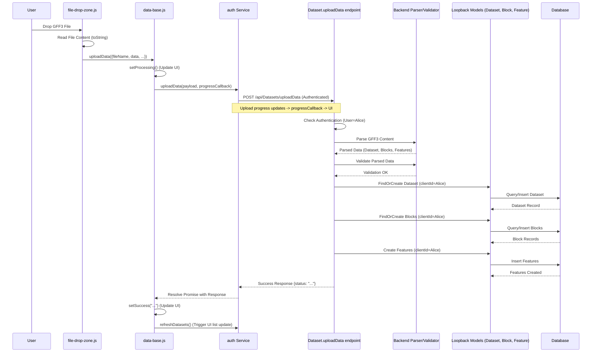

# Chapter 10: Data Upload & Processing

In [Chapter 9: Authentication & Authorization](09_authentication___authorization_.md), we established how Pretzel secures its data by verifying user identity and controlling access permissions. Now that we know *who* can access the system, how do users get their *own* genomic data into Pretzel?

## Motivation: Stocking the Data Warehouse

Think back to the Pretzel backend as a data warehouse ([Chapter 6: Loopback Application & Server](06_loopback_application___server_.md)). While Pretzel might come pre-loaded with public datasets, its real power lies in allowing users to analyze their *own* data – custom genome assemblies, gene annotations, SNP marker sets, or feature aliases.

We need a robust "receiving department" that can:

1.  **Accept Deliveries:** Provide UI elements for users to select files, drag-and-drop them, or even paste data directly.
2.  **Unpack the Goods:** Send the received data securely to the backend.
3.  **Check the Manifest:** Have the backend parse various common bioinformatics file formats (like GFF3, VCF, BED, spreadsheets, JSON) or simpler text/CSV formats.
4.  **Verify Contents:** Validate the data for correctness, consistency, and adherence to required formats. Are the coordinates numeric? Does the chromosome name make sense?
5.  **Store in the Warehouse:** Create or update the corresponding [Loopback Models](08_loopback_models__dataset__block__feature__client__group_.md) (`Dataset`, `Block`, `Feature`, `Alias`) in the database, correctly linking them and assigning ownership to the uploading user.
6.  **Report Status:** Inform the user about the progress and success or failure of the upload process.

This entire workflow, from frontend interaction to backend storage, constitutes Pretzel's Data Upload & Processing capability.

**Our Central Use Case:** A user, "Alice," wants to upload a GFF3 file (`my_genes.gff3`) containing gene annotations for a new Maize genome assembly she's working on. She drags the file onto the Pretzel UI. The system needs to parse this file, potentially create a new `Dataset` and associated `Block` records named according to the GFF3 chromosome identifiers, create `Feature` records for each gene, link everything correctly, assign ownership to Alice, and report success back to her.

## Key Concepts: The Upload Pipeline

The data upload process involves several coordinated steps across the frontend and backend:

1.  **Frontend Interface (`panel/upload/*` components):**
    *   Provides UI elements like file input buttons (`<input type="file">`) or dedicated drag-and-drop areas (`file-drop-zone.js`).
    *   May offer text areas for pasting data (e.g., CSV, handled by components like `panel/upload/data-csv` - not shown in provided context but conceptually similar).
    *   Handles initial client-side validation (e.g., checking file type/extension in `file-drop-zone.js`).
    *   Reads file content using browser APIs (`FileReader`, `readAsArrayBuffer`) or gets text from input fields.

2.  **Data Transmission:**
    *   The frontend bundles the file content (often as a string or binary data) along with metadata (filename, target dataset options) into a payload.
    *   An [Ember Service](07_ember_services__api___state__.md) (typically `auth` or similar, invoked by components like `data-base.js`) sends this payload to a specific backend API endpoint using an authenticated HTTP request (usually POST). Progress updates might be handled during this transmission.

3.  **Backend API Endpoint (Custom Remote Method):**
    *   A dedicated endpoint on the Loopback server, often implemented as a custom remote method on a relevant model like `Dataset` (e.g., `Dataset.uploadData`, `Dataset.tableUpload` in `dataset.js`).
    *   This method receives the raw data payload from the frontend.

4.  **Backend Parsing & Validation:**
    *   The remote method identifies the data format (based on filename extension, MIME type, or explicit user selection).
    *   It uses appropriate libraries or custom logic (potentially leveraging utilities like `common/utilities/load.js`, `common/utilities/upload.js`, `common/utilities/spreadsheet-read.js`) to parse the data.
    *   It performs validation checks: correct number of columns, valid data types, meaningful values (e.g., start <= end coordinates), consistency checks (e.g., do referenced Blocks exist?).

5.  **Backend Database Operations:**
    *   If validation passes, the backend logic interacts with the [Loopback Models](08_loopback_models__dataset__block__feature__client__group__.md).
    *   It finds or creates the parent `Dataset`.
    *   It finds or creates necessary `Block` records.
    *   It creates new `Feature` or `Alias` records, linking them to the correct `Dataset` and `Block`.
    *   Crucially, it assigns ownership (`clientId`) based on the authenticated user making the request (obtained from the access token context). Group sharing (`groupId`) might also be set.
    *   Loopback handles the actual database write operations (insertions/updates) via the configured datasource.

6.  **Feedback Mechanism:**
    *   The backend API endpoint returns a response indicating success (potentially with IDs or names of created records) or failure (with specific error messages).
    *   The frontend service receives this response.
    *   UI components (like `data-base.js`) update their state (`successMessage`, `errorMessage`, `warningMessage`, `isProcessing`) to display feedback to the user.

## Solving the Use Case: Uploading `my_genes.gff3`

Let's follow Alice's GFF3 file through the pipeline:

1.  **Drag and Drop:** Alice drags `my_genes.gff3` onto the `file-drop-zone` component in the Pretzel UI.
2.  **Frontend Validation:** The `validateFile` method in `file-drop-zone.js` checks if the file type/extension is acceptable (e.g., `.gff` or `text/gff3`).
3.  **File Reading:** The `onDrop` handler triggers. The component uses `file.readAsArrayBuffer()` followed by a helper function like `arrayBufferToString` to read the file content as a string.
    ```javascript
    // Simplified logic within file-drop-zone.js / uploadSpreadsheet
    file.readAsArrayBuffer().then((buffer) => {
      const fileName = file.name;
      const data = arrayBufferToString(buffer); // Convert ArrayBuffer to string
      // Option: User might select 'replace existing dataset' or 'create new'
      const replaceDataset = this.replaceDataset; 
      const message = {fileName, data, replaceDataset};
      
      // Call the upload method (likely defined in data-base.js)
      this.uploadData(message); 
    });
    ```
    *Explanation:* Reads the file as an ArrayBuffer, converts it to a string, packages it with the filename and user options, and passes it to the generic `uploadData` function.

4.  **API Call:** The `uploadData` method (likely in `data-base.js`) calls an [Ember Service](07_ember_services__api___state__.md) method (e.g., `auth.uploadData`), providing the `message` payload and a progress callback.
    ```javascript
    // Simplified uploadData in frontend/app/components/panel/upload/data-base.js
    uploadData(data) {
      this.setProcessing(); // Update UI state to 'processing'
      // Call the auth service to perform the actual upload
      let promise = this.get('auth').uploadData(data, this.updateProgress.bind(this)); 
      promise
        .then((res) => {
          this.setSuccess(res.status); // Show success message from backend
          this.get('refreshDatasets')(); // Refresh dataset list in UI
        }, (err) => {
          // Extract and display error message
          let errmsg = err.responseJSON?.error?.message || 'Upload failed'; 
          this.setError(errmsg); 
        });
      return promise;
    }
    ```
    *Explanation:* Sets the UI to a processing state, calls the `auth` service to handle the API request (passing a progress callback), and sets success/error messages based on the response.

5.  **Backend Processing:** The `auth.uploadData` service method POSTs the data to a backend endpoint (e.g., `/api/Datasets/uploadData`). The Loopback server routes this to a custom remote method (`Dataset.uploadData`).
    ```javascript
    // Conceptual Backend: common/models/dataset.js
    // (Actual implementation likely involves utilities like upload.js)
    module.exports = function(Dataset) {
      Dataset.uploadData = async function(data, options) {
        const token = options && options.accessToken;
        const userId = token && token.userId;
        if (!userId) throw new Error('Authentication required.');
        
        const { fileName, data: fileContent, replaceDataset } = data;
        
        // 1. Determine file type (e.g., from fileName '.gff3')
        const fileType = determineFileType(fileName); 
        
        // 2. Parse based on type
        let parsedData; 
        if (fileType === 'gff3') {
          parsedData = parseGff3(fileContent); // { datasetName?, blocks: [ { blockName, features: [...] } ] }
        } else { 
          throw new Error(`Unsupported file type: ${fileName}`);
        }
        
        // 3. Validate parsed data
        validateParsedData(parsedData); 
        
        // 4. Create/Update Database Records
        const datasetName = parsedData.datasetName || generateDatasetName(fileName);
        
        // Find or create Dataset (assign clientId=userId)
        const dataset = await Dataset.app.models.Dataset.findOrCreate(
            { where: { name: datasetName, clientId: userId } }, 
            { name: datasetName, clientId: userId, /* other defaults */ }
        );
        
        // Handle 'replaceDataset' logic if needed (delete old blocks/features)
        if (replaceDataset) { /* ... delete existing content ... */ }
        
        for (const blockData of parsedData.blocks) {
          // Find or create Block (link to dataset, assign clientId)
          const block = await Dataset.app.models.Block.findOrCreate(
              { where: { name: blockData.blockName, datasetId_fk: dataset.getId() } },
              { name: blockData.blockName, datasetId_fk: dataset.getId(), clientId: userId, /* other defaults */ }
          );
          
          // Create Features for this block (link to block, assign clientId)
          const featuresToCreate = blockData.features.map(f => ({
             ...f, // name, value, values etc. from parsed data
             blockId: block.getId(), 
             clientId: userId 
          }));
          await Dataset.app.models.Feature.create(featuresToCreate);
        }
        
        // 5. Return success response
        return { status: `Dataset '${datasetName}' uploaded successfully.` };
      };
      
      // Register the custom remote method
      Dataset.remoteMethod('uploadData', { /* config */ }); 
    };
    ```
    *Explanation:* This conceptual backend method first checks authentication. It parses the file content, validates it, then uses Loopback model methods (`findOrCreate`, `create`) to add the `Dataset`, `Block`, and `Feature` records to the database, ensuring the `clientId` is set correctly from the user's token and relationships (`datasetId_fk`, `blockId`) are established.

6.  **Feedback:** The backend sends the success message. The frontend `uploadData`'s `.then()` handler receives it, calls `setSuccess()`, and updates the UI, showing Alice that her upload was successful.

## Internal Implementation: Under the Hood

**Frontend -> Backend Flow:**

1.  **UI Interaction:** User interacts with `file-drop-zone` or similar component.
2.  **File Read:** Component reads file content (`FileReader` or `arrayBufferToString`).
3.  **Service Call:** Component calls `uploadData` in `data-base.js` base component/utility.
4.  **API Service:** `data-base.js` calls `auth.uploadData` service method.
5.  **AJAX Request:** `auth` service constructs an authenticated POST request (using the Authorizer from [Chapter 9](09_authentication___authorization_.md)) to the backend API endpoint (e.g., `/api/Datasets/uploadData`), potentially using `XMLHttpRequest` to monitor upload progress via `onprogress` events, which calls the `updateProgress` callback passed from `data-base.js`.
6.  **Backend Endpoint:** Loopback routes the request to the custom remote method (`Dataset.uploadData`).
7.  **Backend Logic:** The remote method executes: Authentication check -> Parsing -> Validation -> Database operations ([Loopback Models](08_loopback_models__dataset__block__feature__client__group_.md)).
8.  **Database Interaction:** Loopback models interact with the MongoDB datasource.
9.  **Backend Response:** The remote method returns a JSON success or error object.
10. **AJAX Response:** The `auth` service's AJAX call completes, resolving or rejecting its promise.
11. **UI Update:** The promise handler in `data-base.js` calls `setSuccess` or `setError`, updating the component's tracked properties (`successMessage`, `errorMessage`), causing the UI to display feedback.

**Sequence Diagram (Simplified GFF3 Upload):**



**Relevant Code Snippets:**

*   `frontend/app/components/panel/upload/file-drop-zone.js`: Handles the drag/drop UI, initial validation, file reading, and initiating the upload via `uploadSpreadsheet` (which uses `uploadData`).
*   `frontend/app/components/panel/upload/data-base.js`: Provides common UI state logic (`setProcessing`, `setSuccess`, `setError`, `updateProgress`) and the core `uploadData` method that interacts with the `auth` service.
*   `frontend/app/utils/panel/upload-base.js`: Contains factored-out UI state logic, callable by different upload components.
*   `frontend/app/utils/panel/upload-table.js`: Contains logic specific to pasting/uploading tabular data, including dataset selection/creation (`getDatasetId`).
*   `lb4app/lb3app/common/models/dataset.js`: (Conceptual) Would contain the `Dataset.uploadData` remote method definition and implementation logic as shown above.
*   `lb4app/lb3app/common/utilities/load.js`: Contains backend helpers for reading files (e.g., `fileGzip`).
*   `lb4app/lb3app/common/utilities/upload.js`: (Not provided, but likely exists) Contains higher-level backend logic orchestrating parsing, validation, and database insertion for uploads.
*   `lb4app/lb3app/common/utilities/load-aliases.js`: Specific backend utility for parsing and loading alias data.
*   `lb4app/lb3app/server/boot/create-sample-models.js`: Example boot script showing how backend utilities (`load`, `upload`) might be used for initial data loading.

## Conclusion

The Data Upload & Processing mechanism is Pretzel's "receiving department," enabling users to import their own genomic data. It involves a coordinated effort between frontend components (`file-drop-zone`, `data-base`) managing UI interaction and file reading, [Ember Services](07_ember_services__api___state__.md) handling authenticated API communication, and dedicated backend API endpoints performing parsing, validation, and database operations using [Loopback Models](08_loopback_models__dataset__block__feature__client__group_.md). This pipeline allows users to securely and reliably populate their Pretzel instance with custom datasets, features, and aliases, forming the foundation for personalized comparative genomic analysis.

Once data is uploaded, users often want to share it with collaborators. The next chapter explores how Pretzel manages data sharing through groups.

**Next:** [Chapter 11: Groups Management](11_groups_management_.md)

---

Generated by [AI Codebase Knowledge Builder](https://github.com/The-Pocket/Tutorial-Codebase-Knowledge)