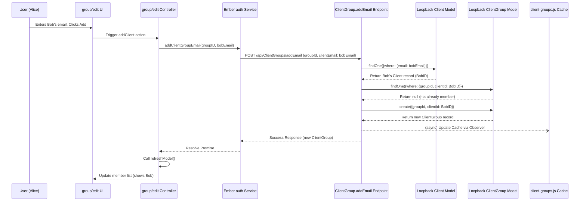

# Chapter 11: Groups Management

In [Chapter 10: Data Upload & Processing](10_data_upload___processing_.md), we learned how users can bring their own data into the Pretzel system. Often, research is a collaborative effort, and users need a way to securely share the datasets they've uploaded with colleagues or team members. How does Pretzel facilitate this collaboration?

## Motivation: Enabling Teamwork and Secure Sharing

Imagine the Pretzel application populated with various datasets, some public, some private. Alice uploaded her new maize genome annotations (`my_genes.gff3`) in the previous chapter. Now, she wants her collaborator, Bob, to be able to view and analyze this specific dataset within Pretzel, but she doesn't want to make it public for everyone.

She needs a mechanism to:

1.  **Define a Team:** Create a designated group within Pretzel (e.g., "Maize Team").
2.  **Manage Membership:** Add Bob (and potentially others) to this group.
3.  **Share Resources:** Explicitly share her private dataset (`my_genes`) with the "Maize Team" group.
4.  **Control Access:** Ensure that only members of the "Maize Team" (like Bob) can access the shared dataset, while it remains hidden from other users.

This requires both frontend interfaces for managing groups and memberships, and backend logic to store this information and enforce sharing permissions. This is the role of Groups Management in Pretzel – providing controlled access akin to shared folders or project teams.

**Our Central Use Case:** Alice wants to create a group named "Maize Team," add Bob as a member using his email address, and then share her private dataset `my_genes` (which she uploaded previously) exclusively with this group, allowing Bob to view it.

## Key Concepts: The Building Blocks of Collaboration

1.  **Backend Models (`Group`, `ClientGroup`):**
    *   As defined in [Chapter 8: Loopback Models](08_loopback_models__dataset__block__feature__client__group__.md), the backend uses specific models to represent groups:
        *   `Group`: Represents the group itself, holding properties like `name`, `writable` (whether members can add datasets), and a `clientId` linking it to its owner (creator).
        *   `ClientGroup`: A join model linking a `Client` (user) to a `Group`, establishing membership. It contains `clientId` and `groupId`.
    *   **Analogy:** `Group` is the shared folder definition, and `ClientGroup` is the list of users who have access to that folder.

2.  **Frontend UI (Routes & Controllers):**
    *   Pretzel provides dedicated UI sections for managing groups, typically handled by specific routes and controllers:
        *   `groups` route/controller (`frontend/app/routes/groups.js`, `frontend/app/controllers/groups.js`): Lists groups the user owns (`groupsOwn`) and groups they are a member of (`groupsIn`). Allows creating new groups.
        *   `group` route/controller (`frontend/app/routes/group.js`, `frontend/app/controllers/group.js`): Displays details of a specific group.
        *   `group/edit` route/controller (`frontend/app/routes/group/edit.js`, `frontend/app/controllers/group/edit.js`): Allows the group owner to edit the group name, change the `writable` setting, add members (often by email), remove members, and view/manage datasets shared with the group.
    *   **Analogy:** These are the "Manage Sharing" or "Team Settings" pages in the application interface.

3.  **Sharing Mechanism (`groupId`):**
    *   Data records like `Dataset` or `Block` have a `groupId` property (see [Chapter 8](08_loopback_models__dataset__block__feature__client__group__.md)).
    *   To share a dataset with a group, the user (typically the dataset owner) modifies the dataset record and sets its `groupId` to the ID of the target group.
    *   If a dataset is private (`public: false`) and has a `groupId`, it's considered shared with that specific group.

4.  **Permissions Enforcement (Backend ACLs & Utilities):**
    *   As discussed in [Chapter 9: Authentication & Authorization](09_authentication___authorization_.md), the backend enforces access.
    *   When a user requests data (e.g., listing datasets), backend logic (often in operation hooks like `observe('access')` using utilities like `common/utilities/identity.js`) checks the requesting user's ID (`clientId`) and their group memberships (obtained from `common/utilities/client-groups.js`).
    *   The database query is filtered to include records where `public` is true, OR `clientId` matches the user's ID, OR `groupId` matches one of the groups the user is a member of.
    *   This ensures users only see public data, their own private data, and data explicitly shared with groups they belong to.

## Solving the Use Case: Sharing `my_genes` with Bob

Let's walk through how Alice sets up the "Maize Team" and shares her dataset:

1.  **Navigate to Groups:** Alice logs into Pretzel and navigates to the "Groups" management page (handled by the `groups` route).
2.  **Create Group:** She uses the UI to create a new group, entering the name "Maize Team". This action triggers a request to the backend, which creates a new `Group` record with Alice as the `clientId` (owner).
3.  **Edit Group:** Alice navigates to the edit page for "Maize Team" (handled by the `group/edit` route).
4.  **Add Member:** In the "Add Member" section, she enters Bob's email address (e.g., `bob@example.com`) and clicks "Add."
    *   The frontend (`group/edit` controller's `addClient` action) sends a request to a backend remote method (e.g., `ClientGroup.addEmail` defined in `lb4app/lb3app/common/models/clientGroup.js`).
    *   The backend finds the `Client` record associated with `bob@example.com`.
    *   It creates a new `ClientGroup` record linking Bob's `clientId` and the "Maize Team" `groupId`. Bob is now a member.
5.  **Share Dataset:** Alice navigates to the management page for her private dataset `my_genes`. She finds a "Share" or "Group" setting (likely a dropdown list populated by groups she owns or is a member of, fetched via `frontend/app/utils/data/groups.js`). She selects "Maize Team" from the list and saves the changes.
    *   The frontend triggers a `save()` on the `Dataset` model.
    *   The backend receives the request to update the dataset and sets its `groupId` property to the ID of the "Maize Team" group.
6.  **Bob's Access:**
    *   Bob logs into Pretzel.
    *   He navigates to view available datasets.
    *   The frontend requests the list of datasets from the backend API.
    *   The backend's `access` hook for the `Dataset` model runs `identity.queryFilterAccessible`. This utility function checks Bob's `clientId` and uses `client-groups.js` to find that Bob is a member of the "Maize Team" group.
    *   The database query filter becomes something like: `WHERE public=true OR clientId=BobID OR groupId=MaizeTeamID`.
    *   The query returns public datasets, Bob's own private datasets, and Alice's `my_genes` dataset (because its `groupId` matches `MaizeTeamID`).
    *   Bob can now see and access the `my_genes` dataset in his list.

## Internal Implementation: Under the Hood

Let's focus on the flow for adding a member to a group.

**Step-by-Step: Adding Bob to "Maize Team"**

1.  **UI Interaction:** Alice is on the `group/edit` page for "Maize Team". She types Bob's email into the input field and clicks the "Add Member" button.
2.  **Controller Action:** The button click triggers the `addClient` action in the `group/edit` controller (`frontend/app/controllers/group/edit.js`).
3.  **API Service Call:** The `addClient` action retrieves the group ID and the entered email. It calls an [Ember Service](07_ember_services__api___state__.md) method (e.g., `auth.addClientGroupEmail`) to handle the backend communication.
    ```javascript
    // frontend/app/controllers/group/edit.js (Simplified addClient)
    addClient() {
      const group = this.model; // The group being edited
      const groupId = group.id;
      const newClientName = this.newClientName; // Email entered by Alice
      // ... clear previous messages ...
      let clientGroupP = this.auth.addClientGroupEmail(groupId, newClientName);
      clientGroupP.then((clientGroup) => {
          console.debug('Member added:', clientGroup);
          this.send('refreshModel'); // Reload group data to show Bob
        })
        .catch((error) => {
          // Display error (e.g., email not found, already member)
          this.set('addClientMsg', error.message || error);
        });
    }
    ```
    *Explanation:* Gets the group ID and email, then calls the `auth` service's `addClientGroupEmail` method, handling success (refreshing the view) or failure (displaying an error).

4.  **AJAX Request:** The `auth` service sends an authenticated POST request to a specific backend endpoint designed for this purpose, likely a custom remote method like `/api/ClientGroups/addEmail` or similar, sending the `groupId` and `clientEmail`.
5.  **Backend Remote Method (`ClientGroup.addEmail`):** The Loopback server routes the request to the `addEmail` method defined in `lb4app/lb3app/common/models/clientGroup.js`.
    ```javascript
    // lb4app/lb3app/common/models/clientGroup.js (Simplified addEmail)
    ClientGroup.addEmail = function(groupId, clientEmail, options, cb) {
      const models = this.app.models;
      // Find the Client (user) by email
      models.Client.findOne({where: {email: clientEmail}})
        .then(function(client) {
          if (!client) {
            // Handle email not found error
            const err = new Error('Email ' + clientEmail + ' not found');
            err.statusCode = 404; return cb(err);
          }
          const clientId = client.getId();
          // Check if user is already in the group
          ClientGroup.findOne({where: {groupId: ObjectId(groupId), clientId: clientId}})
            .then((existing) => {
              if (existing) {
                // Handle already member error
                const err = new Error('Email ' + clientEmail + ' already in group.');
                err.statusCode = 409; return cb(err);
              }
              // Create the ClientGroup record linking user and group
              ClientGroup.create({groupId, clientId}, options, cb);
            }).catch(cb);
        }).catch(cb);
    };
    ```
    *Explanation:* This backend method finds the user (`Client`) by the provided email. If found, it checks if a `ClientGroup` record already exists for that user and group. If not, it creates a new `ClientGroup` record, effectively adding Bob to the group. It uses the callback `cb` to return success or errors.

6.  **Database Operation:** `ClientGroup.create` interacts with the MongoDB datasource to insert the new `ClientGroup` document.
7.  **Backend Caching Update:** The `client-groups.js` utility, which caches group memberships for efficient permission checks, might be updated via observers listening to `ClientGroup` changes (as shown conceptually in its `registerUpdate` logic).
8.  **API Response:** The `addEmail` method calls `cb` with the newly created `ClientGroup` object (on success) or an error object. Loopback sends this back to the frontend.
9.  **Frontend Update:** The `auth.addClientGroupEmail` promise resolves. The `.then()` handler in the `group/edit` controller calls `refreshModel`, which re-fetches the group data from the backend, updating the displayed list of members to include Bob.

**Sequence Diagram (Add Member by Email):**



**Checking Access (Bob listing Datasets):**

1.  Bob's frontend requests `GET /api/datasets`.
2.  Backend `Dataset` model's `access` hook runs.
3.  The hook calls `identity.queryFilterAccessible(ctx)`.
4.  `identity.gatherClientId(ctx)` gets Bob's ID.
5.  `clientGroups.clientGroups.getClientGroups(BobID)` (using the `client-groups.js` utility) retrieves the list of groups Bob belongs to, including `MaizeTeamID`.
6.  `queryFilterAccessible` constructs the `where` clause: `{ or: [ { public: true }, { clientId: BobID }, { groupId: { inq: [..., MaizeTeamID] } } ] }`.
7.  The database query uses this filter, returning Alice's dataset shared via `groupId=MaizeTeamID`.

**Code Snippets:**

*   `frontend/app/utils/data/groups.js`: Contains the `DataGroups` class, used by controllers/routes to fetch group lists (`groupsIn`, `groupsOwn`) for the current user/server. Uses `getGroups`.
*   `frontend/app/utils/data/group.js`: Contains helper functions like `getGroups`, `clientGroupsToGroups`, `removeGroupMember`, `groupDatasets`.
*   `lb4app/lb3app/common/utilities/client-groups.js`: Backend utility responsible for caching client-to-group mappings for efficient permission lookups. Includes `update` and `registerUpdate` methods.
*   `lb4app/lb3app/common/utilities/identity.js`: Includes `queryFilterAccessible` which uses `client-groups.js` to build access control filters for database queries.

## Conclusion

Groups Management provides the essential framework for collaboration and controlled data sharing within Pretzel. By leveraging backend models (`Group`, `ClientGroup`), frontend UI controllers (`groups`, `group/edit`), and secure backend enforcement via ACLs and specialized utilities (`client-groups.js`, `identity.js`), users can create teams, manage memberships, and share specific datasets without compromising privacy. This allows multiple users to work together effectively on shared genomic data within the Pretzel environment.

With data models, layout, linking, components, application structure, backend server, API services, backend models, authentication, data upload, and group management covered, we now turn our attention to how data is transformed between the frontend and backend formats.

**Next:** [Chapter 12: Serializers](12_serializers_.md)

---

Generated by [AI Codebase Knowledge Builder](https://github.com/The-Pocket/Tutorial-Codebase-Knowledge)