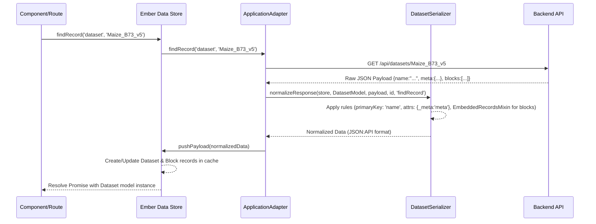

# Chapter 12: Serializers

In [Chapter 11: Groups Management](11_groups_management_.md), we explored how Pretzel manages collaborative data sharing using groups and backend permission checks. We saw how data ownership (`clientId`) and sharing (`groupId`) are stored in the backend models. Now, let's consider how data is formatted as it travels between the frontend application and the backend API. Do they always use the exact same field names and structures? Often, they don't.

## Motivation: Bridging the Formatting Gap

Imagine the Pretzel frontend as the design office and the backend API as the manufacturing plant. The design office uses blueprints (Ember Data models) with specific field names (often camelCase, e.g., `createdAt`) and relationships defined in a certain way. The manufacturing plant, however, might use different field names (e.g., snake_case `created_at` or just `created`), expect data in a slightly different structure (e.g., embedding related items differently), or use different primary identifiers.

When the frontend requests data or sends data to be saved, we need a translation layer to convert between these formats. Without it, the frontend wouldn't understand the backend's response, and the backend wouldn't understand the frontend's request.

This is where **Serializers** come in. They act as the dedicated translation service between the frontend's Ember Data models and the backend's JSON API format. They handle tasks like:

*   Renaming attributes (e.g., backend `meta` field to frontend `_meta` model property).
*   Defining which field acts as the primary key (e.g., using `name` instead of `id` for `Dataset`).
*   Handling embedded vs. sideloaded relationships (how related data like Blocks within a Dataset payload are processed).
*   Cleaning up data being sent to the backend (e.g., removing read-only fields like `createdAt`).

**Our Central Use Case:** When the frontend fetches a `Dataset` record, the backend API might return JSON like this:

```json
{
  "name": "Maize_B73_v5", // Used as ID
  "description": "Maize B73 Version 5 Assembly",
  "meta": { "source": "JGI", "year": 2021 }, // Backend field name
  "blocks": [ // Embedded related records
    { "name": "chr1", "length": 300000000, /* ... */ },
    { "name": "chr2", "length": 240000000, /* ... */ }
  ],
  "clientId": "user123",
  "createdAt": "2023-01-15T10:00:00Z"
}
```

The frontend [Ember Data Model](01_ember_data_models__dataset__block__feature__.md) for `Dataset`, however, uses `_meta` for the metadata (to avoid naming conflicts) and expects the `blocks` relationship to be processed correctly. The Serializer is responsible for transforming the API response into a format the Ember Data store understands.

## Key Concepts: The Translator's Toolkit

Ember Data Serializers sit between the Adapter (which handles the actual HTTP communication) and the Store (which manages the application's data cache and model instances).

1.  **Normalization (API -> Store):** This is the process of transforming the raw data payload received from the API into the structured format that Ember Data expects (typically adhering to the JSON:API specification, or a format the specific serializer understands). This happens when data is fetched (`findRecord`, `findAll`, `query`). Key tasks include:
    *   **Payload Root:** Wrapping the payload if the API doesn't provide a root key (e.g., `{"datasets": [...]}`). The `ApplicationSerializer` often handles this.
    *   **Attribute Mapping (`attrs`):** Renaming keys from the API payload to match the attribute names defined in the Ember Data model (e.g., mapping API's `meta` to model's `_meta`).
    *   **Primary Key (`primaryKey`):** Specifying which field in the API payload should be treated as the record's unique ID (e.g., `name` for `Dataset`).
    *   **Relationship Handling:** Processing embedded records (like the `blocks` array in the use case) or links to related resources so the Store can establish the connections between models. The `EmbeddedRecordsMixin` is often used for embedded data.
    *   **Custom Normalization Logic:** Implementing methods like `normalizeResponse` or `normalize` for complex transformations not covered by declarative configuration.

2.  **Serialization (Store -> API):** This is the reverse process: transforming an Ember Data model record (represented as a `snapshot`) into the JSON payload format expected by the backend API. This happens when data is saved (`model.save()` which triggers `createRecord`, `updateRecord`, or `deleteRecord` on the adapter). Key tasks include:
    *   **Attribute Mapping:** Renaming attributes back to what the API expects (e.g., `_meta` back to `meta`).
    *   **Removing Unwanted Data:** Excluding attributes that shouldn't be sent (e.g., read-only fields like `createdAt`, or temporary client-side state).
    *   **Formatting Relationships:** Structuring relationship data as required by the API (e.g., sending only IDs).

3.  **Base and Specific Serializers:**
    *   `ApplicationSerializer`: Usually the base serializer (`frontend/app/serializers/application.js`). It extends a standard Ember Data serializer (like `RESTSerializer` or `JSONAPISerializer`) and defines application-wide conventions.
    *   Model-Specific Serializers (e.g., `DatasetSerializer`, `BlockSerializer`, `FeatureSerializer`): Extend the `ApplicationSerializer` and define rules specific to that model type (like its primary key or how its relationships are handled).

4.  **Mixins (`EmbeddedRecordsMixin`):** Provide reusable chunks of serialization logic. `EmbeddedRecordsMixin` simplifies handling payloads where related records are nested directly within the parent object's JSON.

## Solving the Use Case: Normalizing the Dataset Payload

Let's see how the `DatasetSerializer` handles the incoming JSON for "Maize_B73_v5":

1.  **API Response Received:** The Adapter gets the JSON payload shown in the motivation section.
2.  **Serializer Invoked:** The Adapter passes the payload to the `normalizeResponse` method of the `DatasetSerializer` (`frontend/app/serializers/dataset.js`).
3.  **Normalization Process:**
    *   The `ApplicationSerializer`'s `normalizeResponse` likely handles wrapping the payload if needed (e.g., `{ "dataset": payload }`).
    *   The `DatasetSerializer`'s specific logic applies:
        *   **Primary Key:** `primaryKey: 'name'` tells Ember Data to use the value of the `name` field (`"Maize_B73_v5"`) as the record's ID.
        *   **Attribute Mapping:** `attrs: { _meta: 'meta' }` directs the serializer to take the value from the `meta` key in the payload and assign it to the `_meta` attribute in the normalized output.
        *   **Embedding:** `attrs: { blocks: { embedded: 'always' } }` combined with the `EmbeddedRecordsMixin` tells the serializer to process the array found under the `blocks` key. For each object in the `blocks` array, it will recursively normalize it using the `BlockSerializer` and include the normalized block data, linking it to the dataset.
4.  **Output:** The serializer produces a normalized data structure (often resembling JSON:API format) that looks something like this conceptually:
    ```json
    {
      "data": {
        "type": "dataset",
        "id": "Maize_B73_v5", // ID from primaryKey 'name'
        "attributes": {
          "description": "Maize B73 Version 5 Assembly",
          "_meta": { "source": "JGI", "year": 2021 }, // Renamed attribute
          "client-id": "user123", // Attributes usually camelized by default
          "created-at": "2023-01-15T10:00:00Z"
          // 'name' attribute might be omitted as it's the ID
        },
        "relationships": {
          "blocks": {
            "data": [
              { "type": "block", "id": "chr1" }, // Assuming BlockSerializer uses name as ID
              { "type": "block", "id": "chr2" }
            ]
          }
        }
      },
      "included": [ // Sideloaded normalized block data
        { "type": "block", "id": "chr1", "attributes": { "length": 300000000, /*...*/ } },
        { "type": "block", "id": "chr2", "attributes": { "length": 240000000, /*...*/ } }
      ]
    }
    ```
5.  **Store Update:** The Ember Data Store receives this normalized data, creates/updates the `Dataset` record with ID `Maize_B73_v5` and the `_meta` attribute correctly populated, and creates/updates the related `Block` records (from the `included` section), establishing the `hasMany` relationship.

## Internal Implementation: Under the Hood

**Normalization Flow (Reading Data):**

1.  **Data Request:** Component/Route calls `store.findRecord('dataset', 'id')`.
2.  **Adapter Request:** Store delegates to the Adapter, which makes the HTTP `GET` request to the API.
3.  **API Response:** Backend sends JSON payload.
4.  **Adapter Receives Response:** Adapter gets the raw JSON.
5.  **Serializer Normalization:** Adapter calls `serializer.normalizeResponse(store, primaryModelClass, payload, id, requestType)`.
    *   Serializer applies rules (primary key, attribute mapping, relationship embedding).
    *   It uses `normalize(modelClass, resourceHash)` for individual records.
    *   Custom helper utilities like `normalizeDataEmbedded` in `utils/ember-serializer.js` might be used for complex, non-standard payloads (e.g., `/groups/in`).
6.  **Normalized Data:** Serializer returns a structured JSON:API-like object.
7.  **Store Processing:** Store consumes the normalized data, updates its internal cache, and creates/updates the relevant Ember Data model instances.
8.  **Promise Resolution:** The original `store.findRecord` promise resolves with the model instance.

**Serialization Flow (Saving Data):**

1.  **Save Request:** User action triggers `model.save()`.
2.  **Store Action:** Store determines the operation (create/update/delete) and calls the Adapter.
3.  **Serializer Serialization:** Adapter calls `serializer.serialize(snapshot, options)` before sending the request.
    *   Serializer applies rules (attribute mapping, removing fields).
4.  **Payload Creation:** Serializer returns the JSON payload formatted for the API.
5.  **Adapter Request:** Adapter sends the HTTP request (POST/PUT/DELETE) with the generated payload.
6.  **API Processing:** Backend receives the request, processes it, and saves changes.
7.  **API Response:** Backend sends confirmation or updated data.
8.  **Adapter/Serializer/Store:** Response is processed (potentially normalized again if data is returned).
9.  **Promise Resolution:** The `model.save()` promise resolves.

**Sequence Diagram (Normalization during `findRecord`)**



**Code Snippets:**

*   `serializers/application.js`: Often a simple extension of `RESTSerializer` or `JSONAPISerializer`. `normalizeResponse` might wrap the payload if the API doesn't provide a root key matching the model name.
    ```javascript
    // frontend/app/serializers/application.js (Simplified)
    import RESTSerializer from '@ember-data/serializer/rest';

    export default RESTSerializer.extend({
      // Example: Wrap payload if API doesn't provide root key
      normalizeResponse(store, primaryModelClass, payload, id, requestType) {
        // Check if payload already has the expected root key
        if (!payload[primaryModelClass.modelName]) {
          let payloadTemp = {};
          // Wrap the payload: e.g., { dataset: { API data } }
          payloadTemp[primaryModelClass.modelName] = payload;
          // Call super with the wrapped payload
          return this._super(store, primaryModelClass, payloadTemp, id, requestType);
        } else {
          // Payload already has root key, pass through
          return this._super(...arguments);
        }
      },
      // ... potentially other application-wide settings ...
    });
    ```
    *Explanation:* This base serializer extends Ember Data's `RESTSerializer`. The `normalizeResponse` hook checks if the incoming `payload` needs to be wrapped with a root key (e.g., `{ "dataset": [...] }`) before passing it to the default normalization logic.

*   `serializers/dataset.js`: Handles `Dataset` specific rules like primary key, attribute mapping, and embedding.
    ```javascript
    // frontend/app/serializers/dataset.js (Simplified)
    import { EmbeddedRecordsMixin } from '@ember-data/serializer/rest';
    import ApplicationSerializer from './application';

    export default ApplicationSerializer.extend(EmbeddedRecordsMixin, {
      primaryKey: 'name', // Use 'name' field as the ID

      attrs: {
        // Map API's 'meta' to model's '_meta'
        _meta : 'meta',
        // Tell EmbeddedRecordsMixin to handle 'blocks' array
        blocks: { embedded: 'always' }
        // Map 'parent' from API to 'parentName' on model if needed
        // parentName : 'parent',
      },

      // Example: Clean up data before sending to API on save
      serialize(snapshot, options) {
        let json = this._super(...arguments);
        // Don't send embedded blocks back when saving Dataset info
        // (Assume blocks are managed separately or not updated here)
        delete json.blocks;
        // Don't send read-only fields
        delete json.createdAt;
        delete json.updatedAt;
        return json;
      }
      // serializeIntoHash needed for specific adapter interactions
    });
    ```
    *Explanation:* This serializer extends the application base and uses `EmbeddedRecordsMixin`. It configures `name` as the `primaryKey`, maps the `meta` field to `_meta` using `attrs`, and tells the mixin to process embedded `blocks`. The `serialize` method demonstrates removing fields (`blocks`, `createdAt`, `updatedAt`) before sending data back to the API.

*   `serializers/feature.js`: Simple attribute mapping.
    ```javascript
    // frontend/app/serializers/feature.js
    import ApplicationSerializer from './application';

    export default ApplicationSerializer.extend({
      attrs: {
        // Map API's 'name' to model's '_name' attribute
        _name : 'name'
      }
    });
    ```
    *Explanation:* A straightforward example mapping the API's `name` field to the Ember model's `_name` attribute, likely to allow for a computed `name` property on the model.

*   `utils/ember-serializer.js`: Contains helper functions for normalizing non-standard API responses, like those from custom group endpoints.
    ```javascript
    // frontend/app/utils/ember-serializer.js (Conceptual normalizeDataEmbedded)
    // ... imports ...
    function normalizeDataEmbedded(store, modelName, modelNameIncluded, includedPlural, d) {
      // ... logic to handle custom payload 'd' ...
      // 1. Normalize the main object 'd' into 'data' (JSON:API structure)
      let data = normalizeData(modelName, host, d);
      let included = [];
      // 2. Process embedded/included objects based on 'modelNameIncluded' list
      modelNameIncluded.forEach(mni => {
        // Find embedded data (e.g., d.clients or d.groupId)
        // Normalize each included item
        // Add normalized items to 'included' array
        // Add relationship entry to data.relationships
      });
      // 3. Return { data, included } structure for the store
      return { data, included };
    };
    ```
    *Explanation:* This utility contains functions like `normalizeDataEmbedded` and `attribute2relationship`, designed to handle specific, non-standard API response structures (like those from `/groups/in` or `/groups/own`) and transform them into the JSON:API format the Ember Data store expects. Serializers like `GroupsInSerializer` call these helpers.

## Conclusion

Ember Data Serializers are the indispensable translators in the Pretzel frontend. They bridge the gap between the data format used by the Ember Data store and models (often conforming to JSON:API conventions or specific model definitions) and the format provided or expected by the Loopback backend API. By handling attribute mapping, primary key definition, relationship embedding/sideloading, and data cleanup during serialization, they ensure smooth data flow and allow the frontend and backend to evolve somewhat independently regarding their internal data structures.

Having explored how data formats are managed, we'll now consider how Pretzel handles potentially different backend API servers and manages data interactions across them.

**Next:** [Chapter 13: API Servers & Multi-Store](13_api_servers___multi_store_.md)

---

Generated by [AI Codebase Knowledge Builder](https://github.com/The-Pocket/Tutorial-Codebase-Knowledge)