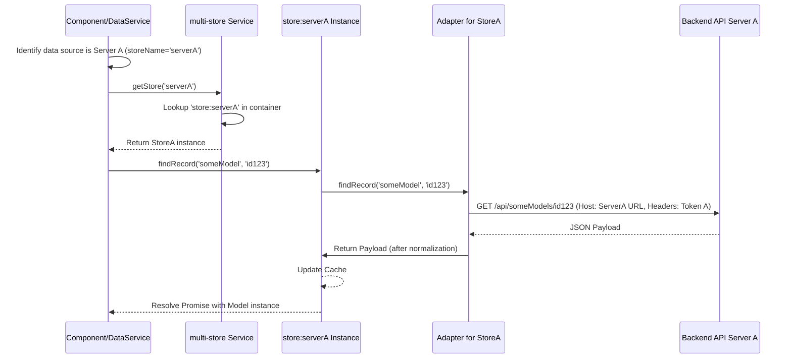

# Chapter 13: API Servers & Multi-Store

In [Chapter 12: Serializers](12_serializers_.md), we saw how data is translated between the frontend's internal format and the backend API's format. This assumes a single backend API. But what if Pretzel needs to connect to *multiple* different backend instances, perhaps a local private server and a public reference server, simultaneously? How does the frontend manage data coming from these distinct sources?

## Motivation: Integrating Data from Multiple Warehouses

Imagine the Pretzel frontend application not just as a single office, but as a central hub designed to interact with several independent data warehouses (backend API servers). These warehouses might hold different kinds of data:

*   **Warehouse A (Local Pretzel):** Private experimental datasets, user uploads, custom annotations.
*   **Warehouse B (Public Germinate):** Curated reference genomes, publicly available markers.
*   **Warehouse C (Another Pretzel Instance):** Data shared by a specific collaborator's institution.

The user might want to visualize data from Warehouse A alongside data from Warehouse B, comparing their private results against a public reference. This presents challenges:

1.  **Connection Management:** The frontend needs to know the address (URL), access credentials (token), and potentially the type (Pretzel, Germinate) of each warehouse.
2.  **Data Isolation:** Data retrieved from Warehouse A must be kept separate from data retrieved from Warehouse B within the frontend's internal systems. Using a single storage system could lead to chaos: what if both warehouses use the ID "chr1" for completely different chromosomes?
3.  **Targeted Requests:** When the frontend needs data for "chr1" from Warehouse B, it must ensure the request goes specifically to Warehouse B's API, using the correct URL and credentials.

Pretzel addresses this using a combination of an **`apiServers` service** to manage connections and a **multi-store** approach where each connected backend gets its own dedicated Ember Data store instance. It's like having separate, labelled filing cabinets (stores) for each data provider, managed by a central registry (`apiServers`) that knows which cabinet belongs to which provider.

**Our Central Use Case:** Alice wants to visualize her private maize annotations (uploaded to her local Pretzel server) alongside the public B73 reference genome data served by a central Germinate instance. She needs Pretzel to connect to both servers, fetch the relevant data from each independently, and display them side-by-side in the visualization panel, potentially drawing links between features identified across both sources (if supported).

## Key Concepts: Managing Multiple Data Sources

1.  **API Server Abstraction (`ApiServer` Utility / Object):**
    *   Each backend connection (Pretzel instance, Germinate instance) is represented by an object, often an instance of a utility class like `ApiServer` (`frontend/app/utils/api-server.js`) or a specialized subclass like `ApiServerGerminate` (`frontend/app/components/service/api-server-germinate.js`).
    *   These objects encapsulate the details of a single connection: its unique name/ID, base URL, authentication token (if applicable), user identifier, and potentially methods specific to that server type (e.g., `getDatasets`).
    *   **Analogy:** A contact card for each data warehouse, holding its address, access codes, and specific communication protocols.

2.  **`apiServers` Service (`frontend/app/services/api-servers.js`):**
    *   This central Ember Service acts as the registry for all active backend connections.
    *   It maintains a list (usually a tracked array) of the `ApiServer` objects.
    *   Responsibilities: Adding new server connections (e.g., after login or manual configuration), removing connections, looking up servers by name or ID, and often identifying a "primary" server (usually the first one added or the one the user logged into).
    *   **Analogy:** The central directory or switchboard that knows about all connected warehouses and can route requests or look up contact details.

3.  **Multi-Store Approach (`multi-store` Service):**
    *   The core idea: Instead of one global Ember Data store, create a *separate, dedicated store instance* for each connected `ApiServer`.
    *   The `multi-store` service (`frontend/app/services/multi-store.js`) manages the creation and registration of these individual store instances within Ember's container system. When a new `ApiServer` is added, this service is used to dynamically register a new store (e.g., `store:server-a`, `store:server-b`).
    *   **Why?**
        *   **Data Isolation:** Prevents ID collisions. `chr1` from Server A and `chr1` from Server B will exist in separate stores and won't conflict.
        *   **Configuration:** Each store can potentially have its own adapter configured with the specific base URL and headers (like the auth token) for its corresponding server. Different server types (Pretzel vs. Germinate) might even require different serializers or adapter logic.
    *   **Analogy:** Each warehouse gets its own dedicated, independent filing system (store instance) within the central hub. The `multi-store` service is responsible for setting up these filing systems.

4.  **Targeted Data Fetching:**
    *   When data needs to be fetched (e.g., loading Blocks for a Dataset), the application logic (often within data services like `data/block` or `data/dataset`) must first identify which `ApiServer` the data originates from.
    *   It then uses the `multi-store` service to retrieve the specific store instance associated with that server.
    *   Finally, it makes the data request (e.g., `storeInstance.findRecord(...)`) using that specific store. This ensures the request goes to the correct backend API endpoint with the appropriate configuration.

## Solving the Use Case: Visualizing Local and Public Data

Let's see how Alice connects to her local Pretzel and the public Germinate server:

1.  **Connect to Local Pretzel:** Alice logs into her local Pretzel instance.
    *   The authentication process (via `pretzel-local` authenticator) succeeds.
    *   The authenticator calls `apiServers.addServer(...)`, providing the local server's URL, Alice's user email, the received token, and her client ID.
    *   The `apiServers` service creates an `ApiServer` object for the local server and adds it to its tracked list. Let's call its unique ID `local-server`.
    *   `apiServers` (or the authenticator) calls `multiStore.registerStore('local-server', { /* adapter config pointing to local URL */ })`. A dedicated store instance is created and registered.

2.  **Connect to Public Germinate:** Alice uses a UI element (e.g., "Add Server" panel) to add the public Germinate instance. Since it's public, no token might be needed.
    *   A component action calls `apiServers.addServer(...)` with the Germinate server's details (URL, potentially type="Germinate").
    *   `apiServers` creates an `ApiServerGerminate` object (a specialized `ApiServer`) and adds it. Let's call its ID `public-germinate`.
    *   `apiServers` calls `multiStore.registerStore('public-germinate', { /* adapter config for Germinate */ })`. Another store instance is created.

3.  **Select Local Dataset:** Alice chooses her private maize dataset from the list. The application identifies this dataset belongs to `local-server`.
    *   When fetching blocks for this dataset, the data service retrieves the correct store: `let localStore = this.multiStore.getStore('local-server');`.
    *   It then calls `localStore.query('block', { datasetId: localDatasetId })`.
    *   `localStore` uses its adapter (configured for the local Pretzel API) to make the request. Data is loaded into `localStore`.

4.  **Select Public Dataset:** Alice adds the B73 reference genome from the public Germinate server. The application identifies this belongs to `public-germinate`.
    *   When fetching its linkage groups (blocks), the data service retrieves the Germinate store: `let germinateStore = this.multiStore.getStore('public-germinate');`.
    *   It calls `germinateStore.query('block', { datasetId: b73DatasetId })` (or equivalent for Germinate API).
    *   `germinateStore` uses its adapter (configured for the public Germinate API) to make the request. Data is loaded into `germinateStore`.

5.  **Visualization:**
    *   Both sets of [Ember Data Models](01_ember_data_models__dataset__block__feature__.md) (from `localStore` and `germinateStore`) now exist in the frontend application's memory.
    *   [Ember Components](04_ember_components__drawing___ui_panels_.md) responsible for rendering the [Stacks & Axes](02_stacks___axes__visualization_layout__.md) can access and display models from both stores side-by-side.
    *   Fetching links ([Paths & Links](03_paths___links__visualization_data__.md)) *between* data in different stores presents a challenge. Standard link fetching relies on adjacent blocks being on the *same* server. Cross-server linking would require custom logic, potentially fetching data from both servers and performing the comparison/linking logic entirely on the frontend, or via a specialized backend endpoint if available. Pretzel's default behavior might limit links to within the same server source.

## Internal Implementation: Under the Hood

**Step-by-Step: Adding a Server and Fetching Data**

1.  **Add Server:** User action triggers `apiServers.addServer(name, url, user, token, clientId)`.
2.  **`apiServers` Logic:**
    *   Creates an `ApiServer` instance (e.g., `ApiServer.create(...)`).
    *   Adds the instance to its tracked `servers` array.
3.  **Register Store:** `apiServers` calls `multiStore.registerStore(server.tabId, { adapterOptions: { host: server.url, headers: { Authorization: server.token } } })`.
4.  **`multiStore` Logic:**
    *   Checks if a store with that name (`server.tabId`) already exists.
    *   If not, it gets the base `store` service constructor.
    *   It defines a new store class extending the base, potentially mixing in custom options or adapter configurations based on `adapterOptions`.
    *   It uses `owner.register(`store:${server.tabId}`, newStoreClass)` to make this new store instance available via dependency injection.
    *   It adds the name to its internal `storeNames` list.
5.  **Data Request:** A component/service needs data associated with the newly added server (e.g., `blockXYZ` known to be on `server.tabId`).
6.  **Identify Store:** Logic determines the store name is `server.tabId`.
7.  **Get Store:** It calls `let specificStore = multiStore.getStore(server.tabId);`.
8.  **`multiStore` Lookup:** `multiStore` uses `owner.lookup(`store:${server.tabId}`)` to retrieve the previously registered store instance.
9.  **Use Store:** The component/service calls `specificStore.findRecord('block', 'blockXYZ')`.
10. **Targeted API Call:** `specificStore` uses its adapter (configured with the server's URL and token during registration) to make the API request specifically to that server.
11. **Data Loaded:** Data is normalized by the store's serializer and loaded into the `specificStore`'s cache.

**Sequence Diagram (Fetching data via specific store):**



**Code Snippets:**

*   `apiServers` Service (`addServer` conceptual):
    ```javascript
    // frontend/app/services/api-servers.js (Simplified)
    import Service from '@ember/service';
    import { A } from '@ember/array';
    import { tracked } from '@glimmer/tracking';
    import ApiServer from '../utils/api-server'; // Utility class
    import { inject as service } from '@ember/service';

    export default class ApiServersService extends Service {
      @service multiStore;
      @tracked servers = A([]);
      @tracked id2Server = {}; // Map ID -> server object

      addServer(name, url, user, token, clientId) {
        // Create server instance (ApiServer or specialized subclass)
        const server = ApiServer.create({ name, url, user, token, clientId, owner: this });
        this.servers.pushObject(server);
        this.id2Server[server.tabId] = server; // Store by generated ID

        // Register a dedicated store for this server
        this.multiStore.registerStore(server.tabId, {
          adapterOptions: { // Pass config to the new store's adapter
            host: url,
            headers: { 'Authorization': token }
          }
        });
        return server;
      }

      get primaryServer() {
        return this.servers.get('firstObject');
      }
      // ... lookup methods ...
    }
    ```
    *Explanation:* Manages the list of `ApiServer` instances. The `addServer` method not only creates the server object but also crucially calls `multiStore.registerStore` to set up a dedicated store instance for this server, passing necessary adapter configurations like the host URL and authorization token.

*   `multiStore` Service (`registerStore`, `getStore`):
    ```javascript
    // frontend/app/services/multi-store.js (Simplified)
    import Service from '@ember/service';
    import { getOwner } from '@ember/application';
    import { A as Ember_A } from '@ember/array';
    import { get as Ember_get, set as Ember_set } from '@ember/object';

    export default Service.extend({
      storeNames: null, // Initialized in init

      init() {
        this._super(...arguments);
        Ember_set(this, 'storeNames', Ember_A());
      },

      isStoreRegistered(name) {
        return Ember_get(this, 'storeNames').indexOf(name) !== -1;
      },

      registerStore(name, options) {
        if (!this.isStoreRegistered(name)) {
          let owner = getOwner(this);
          let baseStore = owner.lookup("service:store"); // Get the base store service
          // Define config for the new store's adapter/serializer if needed
          let storeOptions = {};
          if (options?.adapterOptions) {
             storeOptions.adapter = baseStore.adapterFor('application').constructor.extend(options.adapterOptions);
          }
          // Extend the base store constructor
          let storeInstance = Ember_get(baseStore, "constructor").extend(storeOptions);
          // Register the new store class with the container
          owner.register(`store:${name}`, storeInstance);
          Ember_get(this, 'storeNames').pushObject(name);
          console.log(`Registered store: ${name}`);
          return true;
        }
        return false;
      },

      getStore(name) {
        // Lookup the specific store instance by name
        return getOwner(this).lookup(`store:${name}`);
      }
      // ... unregisterStore, switchInspectorStore ...
    });
    ```
    *Explanation:* The `registerStore` method dynamically defines and registers a new store instance (e.g., `store:local-server`) derived from the base store, potentially configuring its adapter with server-specific details passed in `options`. `getStore` retrieves these specific instances on demand.

*   Example Data Service Usage (Conceptual):
    ```javascript
    import Service from '@ember/service';
    import { inject as service } from '@ember/service';

    export default class DataBlockService extends Service {
      @service multiStore;
      @service apiServers; // To map block ID to server/store name

      async fetchBlock(blockId) {
        // 1. Determine which server this blockId belongs to
        // (Requires a mechanism to map blockId -> server instance/name)
        // Example: let server = this.apiServers.getServerForBlock(blockId);
        let server = this.apiServers.id2Server[blockId]; // If ID contains server info
        if (!server) { throw new Error(`Cannot find server for block ${blockId}`); }
        let storeName = server.tabId; // Get the registered store name

        // 2. Get the correct store instance
        let store = this.multiStore.getStore(storeName);
        if (!store) { throw new Error(`Store not found: ${storeName}`); }

        // 3. Use the specific store to fetch data
        try {
          let blockRecord = await store.findRecord('block', blockId);
          return blockRecord;
        } catch (error) {
          console.error(`Failed to fetch block ${blockId} from store ${storeName}`, error);
          throw error;
        }
      }
    }
    ```
    *Explanation:* A hypothetical data service demonstrates the pattern: identify the source server for the requested data (`blockId`), use that server's unique identifier (`server.tabId`) to get the corresponding store instance from `multiStore`, and then use *that specific store instance* for the data operation (`store.findRecord`).

## Conclusion

Pretzel's ability to connect to multiple backend APIs simultaneously is enabled by the combination of the `apiServers` service and the `multi-store` architecture. `apiServers` manages the connection details (URL, token, type) for each backend, while `multi-store` dynamically creates and manages a separate Ember Data store instance for each connection. This approach ensures data isolation, allows for server-specific configurations (adapters, serializers), and directs data requests accurately to their intended source. While it adds complexity, particularly around cross-server data linking, it provides the flexibility needed to integrate and visualize data from diverse private and public genomic resources within a single interface.

Sometimes, fetching or processing large amounts of data can block the main browser thread, leading to an unresponsive UI. How can Pretzel perform intensive tasks without freezing the application?

**Next:** [Chapter 14: Web Workers](14_web_workers_.md)

---

Generated by [AI Codebase Knowledge Builder](https://github.com/The-Pocket/Tutorial-Codebase-Knowledge)