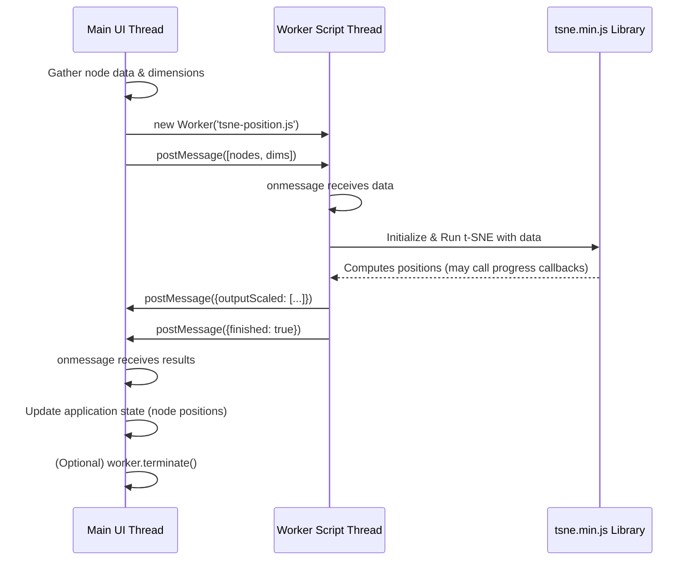

# Chapter 14: Web Workers

In [Chapter 13: API Servers & Multi-Store](13_api_servers___multi_store_.md), we learned how Pretzel can manage connections and data from multiple backend sources. While fetching data is crucial, sometimes the frontend itself needs to perform computationally intensive tasks. Operations like calculating complex layouts for graphs based on feature similarity can take significant time. If performed directly on the main browser thread, these calculations can freeze the user interface, leading to a frustratingly unresponsive application. How can Pretzel perform heavy lifting without blocking the UI?

## Motivation: Keeping the UI Responsive During Heavy Computations

Imagine the Pretzel frontend as a busy reception desk in an office. The receptionist (the main UI thread) needs to remain responsive to user clicks, scrolls, and interactions at all times. Now, imagine a user asks for a complex report that requires significant calculation – like generating a t-SNE layout for thousands of genetic features based on their similarity, a common task for visualizing relationships in Pretzel.

If the receptionist tries to calculate this report themselves, they become completely unavailable to handle any other user requests until the report is finished. The entire reception desk (the UI) freezes.

A better approach is delegation. The receptionist hands off the complex report request to a back-office assistant who works diligently in a separate room (a background thread). The receptionist remains free to interact with users. Once the assistant finishes the report, they bring the results back to the receptionist.

This is precisely the role of **Web Workers** in Pretzel. They allow the application to delegate computationally expensive tasks, like the t-SNE calculation for positioning graph nodes, to a separate background thread. This prevents the main UI thread from becoming unresponsive, ensuring a smooth user experience even during complex calculations.

**Our Central Use Case:** We want to calculate the 2D positions (x, y coordinates) for a set of graph nodes (representing features or other items) using the t-SNE algorithm, based on their similarity scores. This calculation can be slow, so we must perform it in a Web Worker to avoid freezing the Pretzel UI.

## Key Concepts: The Background Assistant

1.  **Separate Thread:** A Web Worker runs in a background thread, separate from the main thread that handles the UI and user interactions. This parallelism is key to its non-blocking nature.
2.  **Message Passing:** The main thread and the worker thread communicate solely through asynchronous messages.
    *   **Main -> Worker:** The main thread uses `worker.postMessage(data)` to send data (like the nodes and configuration) to the worker.
    *   **Worker -> Main:** The worker uses `self.postMessage(results)` (or just `postMessage(results)` inside the worker) to send data (like progress updates or final calculated positions) back to the main thread.
    *   **Listeners:** Both threads use event listeners (`worker.onmessage` or `worker.addEventListener('message', ...)` on the main thread, and `self.onmessage` or `self.addEventListener('message', ...)` inside the worker) to receive messages.
3.  **Isolated Scope:** Workers have their own global context (`self`), distinct from the main thread's `window`. They cannot directly access the DOM (no `document`, no UI manipulation), `window` object methods, or many other browser APIs available to the main thread. They can, however, use many standard JavaScript features, `XMLHttpRequest` (for network requests), and importantly, other workers or libraries imported via `importScripts()`.
4.  **Data Transfer:** Data sent via `postMessage` is typically *cloned* using the structured clone algorithm. This means the sender and receiver get independent copies of the data. For very large data, Transferable Objects can be used to transfer ownership, avoiding the cloning overhead, but this is a more advanced technique.
5.  **Use in Pretzel:** Pretzel primarily uses Web Workers for the t-SNE node positioning calculation, leveraging the `tsne-js` library within the worker.

## Solving the Use Case: Calculating t-SNE Positions in the Background

Let's outline how Pretzel performs the t-SNE calculation using a Web Worker:

1.  **Initiation (Main Thread):** A component or service decides to calculate the t-SNE layout. It gathers the necessary data: the list of nodes (each potentially with a pre-computed vector representation) and the dimensions of the target display area (width, height).
2.  **Worker Creation (Main Thread):** It creates a new `Worker` instance, pointing to the worker script file. The path needs to be relative to the application's deployed assets.
    ```javascript
    // Conceptual Frontend Code (e.g., in a service or component)
    const nodes = [/* ... array of node objects with vectors ... */];
    const graphDimensions = { width: 800, height: 600 };

    // Create the worker (path relative to deployed assets)
    const tsneWorker = new Worker('assets/web-workers/tsne-position.js');
    ```
    *Explanation:* Creates a new background thread executing the code found in `assets/web-workers/tsne-position.js`.

3.  **Sending Data (Main Thread):** The main thread sends the node data and dimensions to the worker.
    ```javascript
    // Send data to the worker
    tsneWorker.postMessage([nodes, graphDimensions]);
    console.log("Sent data to t-SNE worker.");
    ```
    *Explanation:* Sends an array containing the `nodes` and `graphDimensions` objects to the worker. The worker will receive this in its `onmessage` handler.

4.  **Worker Processing (Worker Thread - `tsne-position.js`):**
    *   The worker script first imports necessary libraries using `importScripts()`.
    *   It sets up an `onmessage` listener to receive data from the main thread.
    *   When a message arrives, it extracts the `nodes` and `graphDimensions`.
    *   It initializes the `tsne-js` library with the data and parameters (like perplexity, learning rate, iterations).
    *   It runs the t-SNE algorithm. `tsne-js` might provide progress callbacks.
    *   During or after calculation, the worker formats the results (nodes with new `x`, `y` properties).

    ```javascript
    // Simplified Worker Code (frontend/public/assets/web-workers/tsne-position.js)

    // Import required libraries (copied via ember-cli-build.js)
    importScripts('./tsne.min.js'); // The t-SNE library
    importScripts('./cosineSimilarity.js'); // Helper library
    /* global TSNE, cosineSimilarity */

    self.addEventListener('message', function(e) {
      const [nodes, graphDimensions] = e.data; // Receive data
      console.log("Worker received nodes:", nodes.length);

      // Define a function to send progress/results back
      function sendProgress(outputScaled) {
        postMessage({ outputScaled: outputScaled }); // Send calculated positions
      }

      // Initialize and run t-SNE (using a helper class from the full script)
      const tsneRunner = new TsnePosition(sendProgress);
      tsneRunner.tsnePosition(nodes, graphDimensions);

      // Send a final message indicating completion
      postMessage({ finished: true });

    }, false);

    // Example of the helper class (from the full script)
    class TsnePosition {
      constructor(progressCallback) { this.progressCallback = progressCallback; }
      tsnePosition(nodes, graphDimensions) { /* ... setup TSNE ... */ }
      nodesScaled(model, nodes) { /* ... calculate x, y from model output ... */ }
      progressData(outputScaled) { /* ... called by TSNE library during run ... */ }
      force(i, j) { /* ... calculate similarity using cosineSimilarity ... */ }
    }
    // ... (rest of the TsnePosition class implementation) ...
    ```
    *Explanation:* The worker imports the `tsne.min.js` and `cosineSimilarity.js` libraries. It listens for messages, unpacks the data, runs the t-SNE calculation (details encapsulated in `TsnePosition` class), and uses `postMessage` to send results back to the main thread.

5.  **Receiving Results (Main Thread):** The main thread listens for messages from the worker.
    ```javascript
    // Main thread listener
    tsneWorker.onmessage = function(event) {
      if (event.data.outputScaled) {
        console.log("Received updated positions from worker.");
        // Update UI with the new node positions
        updateNodePositions(event.data.outputScaled);
      } else if (event.data.finished) {
        console.log("Worker finished t-SNE calculation.");
        // Optionally terminate the worker if no longer needed
        // tsneWorker.terminate();
      } else if (event.data.started) {
        console.log("Worker has started.");
      } else {
        console.log("Received message from worker:", event.data);
      }
    };

    tsneWorker.onerror = function(error) {
      console.error("Error in t-SNE worker:", error.message, error);
      // Handle error appropriately
    };

    function updateNodePositions(nodesWithPositions) {
      // Logic to update the Ember models or component state
      // This will trigger UI re-rendering
      console.log("Updating UI with new positions for", nodesWithPositions.length, "nodes");
      // e.g., this.set('nodes', nodesWithPositions);
    }
    ```
    *Explanation:* Sets up `onmessage` and `onerror` handlers. When `outputScaled` data arrives, it calls a function to update the application state, triggering a UI refresh with the new node positions. It also handles the 'finished' message.

6.  **UI Update (Main Thread):** The `updateNodePositions` function updates the component's state or modifies the Ember Data models, causing the visualization to redraw with the nodes in their newly calculated t-SNE positions.

## Internal Implementation: Under the Hood

**Frontend -> Worker -> Frontend Flow:**

1.  **Trigger:** User action or application logic initiates the layout calculation.
2.  **Worker Instantiation:** Frontend code executes `new Worker('path/to/worker.js')`. The browser starts a new thread and loads the script.
3.  **Data Preparation:** Frontend gathers node data and parameters.
4.  **Send Data:** Frontend calls `worker.postMessage(data)`. The browser clones the data and queues it for the worker thread.
5.  **Worker Receives Data:** The worker thread's event loop picks up the message, triggering the `self.onmessage` handler.
6.  **Worker Computation:** The worker script executes the t-SNE algorithm using the received data and imported libraries (`tsne.min.js`). This happens entirely within the worker thread.
7.  **Send Results:** The worker calls `postMessage(results)`. The browser clones the results and queues them for the main thread.
8.  **Main Thread Receives Results:** The main thread's event loop picks up the message, triggering the `worker.onmessage` handler.
9.  **UI Update:** The main thread handler updates application state (component properties, models) with the calculated positions. Ember's rendering engine redraws the affected parts of the UI.
10. **(Optional) Termination:** Main thread calls `worker.terminate()` if the worker is no longer needed, freeing up resources.

**Sequence Diagram (t-SNE Calculation):**



**Build Process Integration (`ember-cli-build.js`):**

Web Worker scripts and their dependencies are not typically part of the standard Ember module system. They need to be treated as separate assets. The `ember-cli-build.js` file uses `app.import` to copy these files into the final `dist/assets` directory, making them accessible via a public URL path (like `assets/web-workers/tsne-position.js`) when the application is deployed.

```javascript
// frontend/ember-cli-build.js (Relevant Snippets)
module.exports = function (defaults) {
  const app = new EmberApp(defaults, {
    // ... other options ...
  });

  // Import the t-SNE library and copy it to the assets folder
  app.import('node_modules/tsne-js/build/tsne.min.js', {
    outputFile : 'assets/web-workers/tsne.min.js'
  });
  // Import the cosine similarity helper library
  app.import('node_modules/vector-cosine-similarity/lib/cosineSimilarity.js', {
    outputFile : 'assets/web-workers/cosineSimilarity.js'
  });

  // The main worker script tsne-position.js is usually placed in frontend/public/assets/web-workers/
  // Files in the `public` directory are automatically copied to `dist` during the build.
  // (Alternatively, it could also be imported using app.import if it resides elsewhere)

  return app.toTree();
};
```
*Explanation:* These `app.import` lines tell the Ember build process to find the specified libraries in `node_modules` and copy them to the `dist/assets/web-workers/` directory during the build. This ensures that when the main thread executes `new Worker('assets/web-workers/tsne-position.js')`, the browser can find the worker script, and similarly, when the worker executes `importScripts('./tsne.min.js')`, it can load its dependencies from the same relative path.

## Conclusion

Web Workers provide a vital mechanism for Pretzel to perform computationally intensive tasks like t-SNE layout calculations without blocking the main UI thread. By delegating these tasks to a background script and communicating via asynchronous messages, Pretzel maintains a responsive and smooth user experience. The worker operates in an isolated environment, executing libraries like `tsne-js`, and sends results back to the main thread for updating the visualization. Understanding this pattern is key to appreciating how Pretzel handles potentially long-running frontend computations gracefully.

Finally, applications often require different settings depending on the environment (development, testing, production). How does Pretzel manage these configurations?

**Next:** [Chapter 15: Configuration Management](15_configuration_management_.md)

---

Generated by [AI Codebase Knowledge Builder](https://github.com/The-Pocket/Tutorial-Codebase-Knowledge)