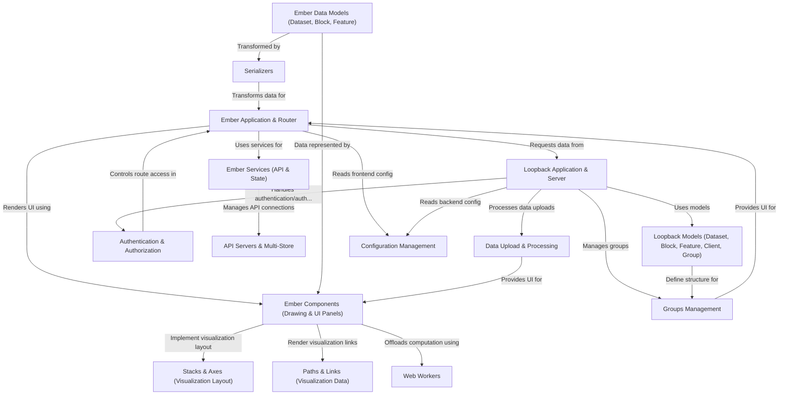

# Tutorial: pretzel

Pretzel is a web application for **comparative genomics visualization**.
It features an *Ember.js frontend* displaying genomic datasets, blocks (e.g., chromosomes), and features (e.g., genes/markers) arranged in interactive stacks and axes.
A *Loopback backend API* serves the data, handles user authentication, group management, and data uploads.

**Source Repository:** [None](None)

## Chapters

1. [Ember Data Models (Dataset, Block, Feature)
](01_ember_data_models__dataset__block__feature__.md)
2. [Stacks & Axes (Visualization Layout)
](02_stacks___axes__visualization_layout__.md)
3. [Paths & Links (Visualization Data)
](03_paths___links__visualization_data__.md)
4. [Ember Components (Drawing & UI Panels)
](04_ember_components__drawing___ui_panels__.md)
5. [Ember Application & Router
](05_ember_application___router_.md)
6. [Loopback Application & Server
](06_loopback_application___server_.md)
7. [Ember Services (API & State)
](07_ember_services__api___state__.md)
8. [Loopback Models (Dataset, Block, Feature, Client, Group)
](08_loopback_models__dataset__block__feature__client__group__.md)
9. [Authentication & Authorization
](09_authentication___authorization_.md)
10. [Data Upload & Processing
](10_data_upload___processing_.md)
11. [Groups Management
](11_groups_management_.md)
12. [Serializers
](12_serializers_.md)
13. [API Servers & Multi-Store
](13_api_servers___multi_store_.md)
14. [Web Workers
](14_web_workers_.md)
15. [Configuration Management
](15_configuration_management_.md)

---

Generated by [AI Codebase Knowledge Builder](https://github.com/The-Pocket/Tutorial-Codebase-Knowledge)